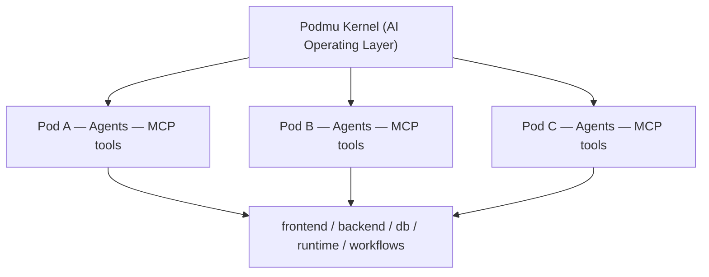

# CLAUDE.md

This file provides guidance to Claude Code (claude.ai/code) when working with code in this repository.

---

## Project Status

The vision is in `Goals.md`; the formal V1 architecture is in `docs/` (read
before designing or coding). **Implementation has begun** — Go module
`github.com/kliqulink/podmu_ai`, starting from the dependency-root: the Pod
manifest + Bundle loader/validator (spec 1).

## Building & Running

Go 1.26+. Only dependency is `gopkg.in/yaml.v3`.

```bash
go build ./...                              # build all
go test ./...                               # run tests
go test ./pod -run TestLoad -v              # a single test/group
go vet ./... && gofmt -l pod cmd            # vet + format check (empty = clean)

go run ./cmd/podctl validate <bundle-dir>   # load+validate a .pod bundle (+ compatibility)
go run ./cmd/podctl info     <bundle-dir>   # summarize a bundle
go run ./cmd/podctl id                      # generate a fresh Pod id (ULID)
```

### Code layout

- `pod/` — the Pod package: `manifest.go` (pod.yaml types), `bundle.go`
  (load + ref-resolution + thick/thin), `validate.go` (V1 rules: ULID ids,
  slugs, **no inlined secrets**, ref-escape, known memory stores),
  `version.go` (the runtime compatibility handshake, pod-spec §9.2),
  `id.go` (ULID generation/validation). Sample bundle in `pod/testdata/`.
- `cmd/podctl/` — CLI over the package.

Conventions: strict YAML decoding (unknown fields error); validation returns
`ValidationErrors` (all problems at once, not first-only); a Bundle is inert —
loading never executes anything (pod-spec §10).

## Design Specs (read in order)

## Design Specs (read in order)

The V1 architecture is fully specified in `docs/`. Each spec builds on the
prior ones; read in this order:

1. `docs/specs/pod-spec.md` — the Pod abstraction; the two-plane model (Definition vs State)
2. `docs/domain-model.md` — vocabulary, system tiers, declaration→engine→infra
3. `docs/specs/runtime-arch.md` — execution; **deterministic core / journaled effects**
4. `docs/specs/event-system.md` — log = truth; per-Pod JetStream stream; envelope & replay
5. `docs/specs/workflow-engine.md` — deterministic declarative orchestration graphs
6. `docs/specs/agent-runtime.md` — the agent loop as a journaled deterministic loop
7. `docs/specs/memory-system.md` — projections; the snapshot mechanism
8. `docs/specs/tool-runtime-mcp.md` — bidirectional edge; idempotency; ingress contract
9. `docs/specs/frontend-renderer.md` — projection; render-read / interact-emit; a channel
10. `docs/specs/deployment.md` — materialization + the Stage 1→2→3 evolution seam
11. `docs/specs/governance-hitl.md` — cross-cutting: hard policy constraints + human intervention (Governor & HITL)
12. `docs/specs/kernel-fencing.md` — single-writer safety: leases + epoch fencing tokens enforced at the data tier
13. `docs/specs/state-plane-governance.md` — PII crypto-shredding, snapshot cadence, cold tiering, portability boundary
14. `docs/specs/marketplace-tool-trust.md` — third-party MCP trust: tiers, signed manifests, brokered egress, revocation

**The one principle threading every layer:** *nondeterminism is pushed to the
edge and journaled; everything else is a deterministic projection of an
append-only event log.* This is what makes the system replayable, crash-safe,
portable, forkable, and evolvable. Preserve it in any implementation work.

When implementation begins, each spec's "Interfaces" section defines the
contracts to build against, and its "Deferred / Open Questions" section lists
what is intentionally unresolved.

---

## What Podmu Is

Podmu is an **AI-native business operating system** — not a website builder or chatbot platform. The core insight: a business is not just data, it is a *runtime entity*. Users describe their business vision; Podmu handles brand identity, website, funnel, campaigns, content, lead management, follow-up, closing, and continuous optimization via AI agents.

---

## Core Abstraction: The Pod

A **Pod** is a *Portable Autonomous Business Unit* — a stateful package that represents a "Business Cognitive Boundary." Each Pod contains:

- **Identity Layer** — brand, niche, audience, positioning, goals, tone
- **Memory Layer** — customer patterns, campaign history, lead behavior, conversion insights (short-term, long-term, vector, summarized, event memory)
- **Agent Layer** — multi-agent system (strategist, SEO writer, content creator, ads manager, WhatsApp closer, analyst); all agents share context, goals, memory, and tools
- **Workflow Layer** — event-driven, async, resumable, replayable business automation graphs (lead capture, follow-up, content generation, SEO, publishing, optimization)
- **Tool Layer (MCP)** — Model Context Protocol as the universal tool/integration protocol; agents see semantic actions (`send_message`, `publish_post`, `create_invoice`) not raw API calls
- **Deployment Layer** — frontend, backend, worker, vector memory, automation runtime, AI execution runtime

**Pod Runtime** (not portable) — executes agents, workflows, events, tool calls, scheduling, and AI orchestration.

**Pod Bundle** (portable) — serialized business state: memory, workflows, branding, prompts, assets, knowledge, deployment config, stored as `mybusiness.pod/` directory with `pod.yaml` at root.

---

## System Architecture



**Isolation is by namespace, not by infrastructure.** Every Pod has isolated context, workflow, memory, and agent state — but shares underlying infrastructure (at least in V1).

---

## Planned Tech Stack

| Layer | Technology |
|---|---|
| Backend | Go |
| Database | PostgreSQL (shared cluster, `pod_id` row-level security) |
| Queue / Events | NATS |
| Vector Memory | Qdrant |
| Object Storage | S3-compatible |
| Workflow Engine | Temporal or custom runtime |
| Frontend | Next.js |

---

## Database Design Principles

All tables carry a `pod_id UUID` column. Isolation is enforced at the application layer and optionally via PostgreSQL row-level security:

```sql
CREATE POLICY pod_isolation ON customers
USING (pod_id = current_setting('app.current_pod')::uuid);
```

No dedicated database per pod in V1.

---

## Event-Driven Flow

Business operations flow through events:

```
new_lead → strategist analyzes → CRM updated → WA follow-up triggered
→ personalized offer generated → closer agent continues → analytics updated
```

Events carry `type` + `payload` (e.g., `lead.created`). Workflows subscribe to and react to events.

---

## Pod Evolution Stages

- **Stage 1 (Lightweight):** Shared DB, shared workers, shared queues
- **Stage 2 (Growing):** Dedicated workers, queues, vector namespace
- **Stage 3 (Sovereign):** Dedicated infra, runtime, database, deployment, AI compute

V1 targets Stage 1 only.

---

## V1 Scope

**Build:** pod abstraction, shared runtime, memory system, event system, workflow orchestration, AI agents, namespace isolation.

**Do not build in V1:** multi-cluster, dedicated infra per pod, Kubernetes, sovereign deployments.

---

## Long-Term Vision

Future: `pod clone`, `pod fork`, `pod deploy`, `pod rollback`, `pod export` — a "Business Git." Plus a marketplace where users can sell, fork, and reuse pod bundles (funnels, workflows, business intelligence).
