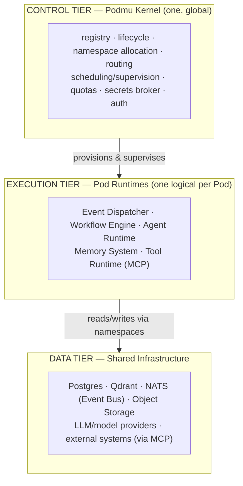
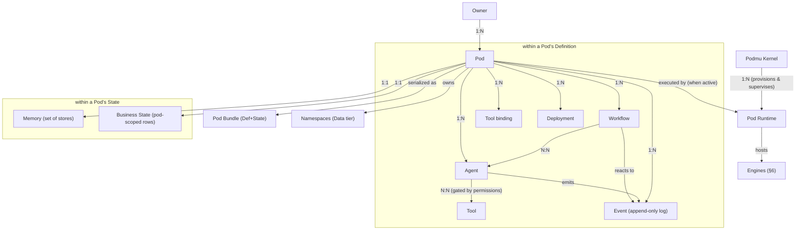

# Domain Model & Glossary

**Status:** Draft · **Spec version:** `podmu.dev/v1` · **Layer:** Foundational

> This document fixes the vocabulary. Every other spec must use these terms with
> exactly these meanings. It builds directly on [`specs/pod-spec.md`](specs/pod-spec.md);
> read that first. Where the two disagree, the Pod spec wins and this document is
> the bug.

---

## 1. How to Read This Document

Three different *kinds* of thing are easy to conflate. Keep them separate:

1. **Entities** — nouns that exist in the model (Pod, Agent, Event, …). §4
2. **Engines** — Runtime subsystems that *execute* declarations (Workflow
   Engine, Agent Runtime, …). They are not entities; they are machinery. §6
3. **Tiers** — the system's three architectural tiers (Control / Execution /
   Data). §3

Also recall the **two planes** *of a Pod* from the Pod spec: **Definition**
(authored) and **State** (accumulated). "Plane" always means a plane *of a Pod*.
"Tier" always means a *system* tier. They are different axes and never
substitute for each other.

---

## 2. The One-Paragraph Model

A **Kernel** manages many **Pods** on behalf of **Owners**. Each Pod is a
portable business, serialized as a **Bundle**. When a Pod is `active`, the
Kernel gives it a **Runtime** — an execution context whose **engines** run the
Pod's declared **Agents**, **Workflows**, and **Tools**, read and write its
**Memory**, and react to **Events**. Everything a Pod does is mediated by Events
flowing over the **Event Bus**, and everything it touches lives inside the Pod's
own **namespaces** on shared infrastructure. **Deployments** project Pod state
outward (e.g. a website); they are never the source of truth.

---

## 3. System Tiers

- **Control tier** is singular and multi-tenant. It never executes business
  logic; it allocates, routes, supervises, and enforces.
- **Execution tier** is per-Pod *logically*. In V1 (Stage 1 of the Pod
  Evolution Model) many logical Runtimes are co-located in a **shared Runtime
  fleet**; at Stage 3 a Pod may get a dedicated one. The logical boundary is
  invariant regardless of physical packing.
- **Data tier** is shared but **namespaced per Pod** (Pod spec §8). Sharing is
  physical; isolation is logical.

---

## 4. Entity Glossary

Each entry: canonical definition · **Plane/Tier** · **Lifetime** · *not to be
confused with*.

### Owner (Principal)
The user or organization that owns one or more Pods. The authority against which
permissions and ownership transfers are evaluated.
**Tier:** Control · **Lifetime:** account-scoped · *Not* a Pod.

### Podmu Kernel
The global, multi-tenant control plane that manages the full Pod fleet:
identity allocation, lifecycle orchestration, namespace provisioning, event
routing, Runtime scheduling/supervision, quota and permission enforcement, and
global services Pods cannot provide for themselves (auth, billing, secrets
broker).
**Tier:** Control (singular) · **Lifetime:** platform · *Not* a Runtime, *not* a
Pod. Analogy: OS kernel to a process.

### Pod
A portable autonomous business unit; a business cognitive boundary. Composed of
a Definition plane and a State plane. The central abstraction
([`pod-spec.md`](specs/pod-spec.md)).
**Identity:** immutable `id` (ULID) · **Lifetime:** spans many versions and runs;
outlives any single Runtime · *Not* a tenant, container, or database row.

### Pod Bundle
The serialized form of a Pod at rest — a directory or `.pod` archive containing
the Definition plane and (thick) or referencing (thin) the State plane.
**Plane:** both · **Lifetime:** a snapshot artifact · *Not* the live Pod; *not*
executable on its own.

### Pod Runtime
The logical execution context that runs exactly one Pod while it is `active`.
Hosts the engines (§6). Never serialized into a Bundle.
**Tier:** Execution · **Lifetime:** bounded by the Pod's `active`/`degraded`
states; created on provision, torn down on pause/archive · *Not* the Kernel;
*not* part of the Pod.

### Agent
A declared AI worker with a role, model, system prompt, memory scope, and
permitted tools. Agents in a Pod share its context, goals, memory, and tools —
they are collaborators, not isolated services. Declarations live in the
Definition plane; they are *executed by* the Agent Runtime.
**Plane:** Definition (declaration) · **Addressing:** by `name` within the Pod ·
*Not* a microservice; an agent holds no execution logic of its own.

### Workflow
An event-driven automation graph: the only place control flow lives. Reacts to
Events, invokes Agents and Tools, and is resumable and replayable. Declared in
the Definition plane; *executed by* the Workflow Engine.
**Plane:** Definition (declaration) · **Addressing:** by `name` within the Pod ·
*Not* an Agent (agents act; workflows orchestrate).

### Event
An immutable, typed record that something happened, scoped to a Pod
(`lead.created`, `pod.lifecycle.activated`). The unit of causality. Carried on
the Event Bus, persisted in the Pod's event log (State plane).
**Plane:** State (the log) · **Identity:** own `event_id` (ULID) + `pod_id` ·
**Lifetime:** permanent (append-only) · *Not* a request; events are facts, not
calls.

### Memory
The Pod's cognition over time: short-term, long-term, vector, summarized, and
event memory. *Accessed via* the Memory System engine.
**Plane:** State · **Lifetime:** grows with the Pod; snapshotted on
export/fork · *Not* business state (domain rows like orders); memory is learned
insight, business state is operational record.

### Tool (MCP Binding)
A semantic action bound to an external system via the Model Context Protocol
(`send_message`, `create_invoice`). Agents see the semantic action, never the
provider API. Declared in the Definition plane; *executed by* the Tool Runtime.
**Plane:** Definition (binding) · *Not* an SDK or raw API client.

### Deployment
A descriptor for a renderable/runnable projection of Pod state (frontend,
backend, worker). The Frontend Renderer materializes a `frontend` deployment
from Identity + Branding + Knowledge + Business State.
**Plane:** Definition (descriptor) · *Not* a source of truth — always a
projection.

### Namespace
A Pod's exclusive slice of a shared backing system, keyed off its `id`
(`postgres_scope`, `vector_scope`, `queue_scope`, `storage_scope`; Pod spec §8).
**Tier:** Data · *Not* infrastructure ownership — the system is shared, the
namespace is exclusive.

### Event Bus
The shared messaging backbone (NATS in V1) over which all Events flow, subject
prefixed per Pod (`pod.<id>.>`). The Kernel routes; the Runtime's Event
Dispatcher subscribes within the Pod's subject scope.
**Tier:** Data · *Not* a workflow engine — the bus transports, it does not
orchestrate.

---

## 5. Relationship Map

### Cardinalities (normative)

| Relationship | Cardinality | Note |
|---|---|---|
| Owner → Pod | 1 : N | ownership transferable (audited Event) |
| Kernel → Pod | 1 : N | one global Kernel |
| Pod → Bundle | 1 : 1 *per version* | a Bundle is a Pod serialized at a `pod_version` |
| Pod → Runtime | 1 : 1 | exactly one logical Runtime while active (Pod spec §12) |
| Pod → Agent / Workflow / Tool / Deployment | 1 : N | declared in Definition |
| Workflow → Agent | N : N | workflows invoke agents |
| Agent → Tool | N : N | use gated by `permissions.tool_scopes` |
| Pod → Memory | 1 : 1 | one memory comprising several stores |
| Pod → Event | 1 : N | the event log; append-only |

---

## 6. Declaration → Engine → Backing System

The pivotal relationship in the system: a Pod **declares**, a Runtime engine
**executes**, shared infra **backs** it. Authored layers that are merely
*consumed* (not executed) have no engine.

| Declared in Pod (Definition) | Executed by (Runtime engine) | Backed by (Data tier, namespaced) |
|---|---|---|
| `agents/*.yaml` | **Agent Runtime** | LLM/model provider + Memory |
| `workflows/*.yaml` | **Workflow Engine** | Event Bus + durable execution store |
| `tools` (MCP bindings) | **Tool Runtime (MCP)** | external providers via MCP |
| `memory` config | **Memory System** | Postgres + Qdrant |
| `deployments` | **Deployment projector / Frontend Renderer** | Object Storage + edge |
| inbound/outbound events | **Event Dispatcher** | Event Bus (NATS) |
| `identity` · `branding` · `knowledge` | *(consumed, not executed)* | — |

**Rule:** no engine reaches outside its Pod's namespaces; the Runtime sets the
per-Pod execution context (e.g. `app.current_pod`) before any engine runs.

---

## 7. Naming & Identity Conventions

So every spec, schema, and log line agrees:

- **Global identifiers** are prefixed ULIDs: `pod_…`, `usr_…`, `event_…`.
  Immutable, never reused.
- **Intra-Pod entities** (Agents, Workflows) are addressed by **`name`** within
  the Pod's namespace — not global IDs. They are meaningful only relative to
  their Pod.
- **Tools** are addressed by **`name`** within the Pod; the binding maps the
  name to a provider.
- **Events** are named `<entity>.<verb-past-tense>`: `lead.created`,
  `order.paid`, `pod.lifecycle.activated`. Lowercase, dot-delimited, past tense
  (events are facts that already happened).
- **NATS subjects** are `pod.<pod_id>.<event-name>`; the Pod's subject scope is
  `pod.<pod_id>.>`.
- **Secret references** use the `secret://pod/<slug>/<key>` form; secrets are
  never inlined (Pod spec §6).

---

## 8. Forbidden Conflations

These mistakes corrupt the model. Reviewers should reject them on sight.

1. **Pod = tenant / container / DB row.** A Pod is a cognitive business
   boundary; infrastructure is shared beneath it.
2. **Runtime = Kernel.** Kernel is the singular control plane; a Runtime is a
   per-Pod execution context the Kernel supervises.
3. **Runtime inside the Bundle.** The Bundle is inert; the Runtime executes it
   and is never serialized into it (Pod spec §10).
4. **Memory = business state.** Memory is learned insight (State plane);
   business state is operational domain data (also State plane, but distinct —
   one informs decisions, the other records transactions).
5. **Event = request.** Events are immutable facts on a bus, not synchronous
   calls. The system is event-driven, not request-response.
6. **Frontend = source of truth.** The frontend is a projection of Pod state.
7. **Agent = service.** An Agent is a declaration executed by the Agent Runtime;
   it contains no standalone execution logic.
8. **"Plane" used for system tiers.** Planes are Definition/State (of a Pod);
   tiers are Control/Execution/Data (of the system).

---

## 9. Glossary Quick Reference

| Term | One line | Plane/Tier |
|---|---|---|
| Owner | Account that owns Pods | Control |
| Kernel | Global multi-tenant control plane | Control |
| Pod | Portable autonomous business unit | (both planes) |
| Bundle | Serialized Pod at rest | (both planes) |
| Runtime | Per-Pod execution context | Execution |
| Engine | Runtime subsystem that executes a declaration | Execution |
| Agent | Declared AI worker | Definition |
| Workflow | Event-driven orchestration graph | Definition |
| Tool | MCP-bound semantic action | Definition |
| Deployment | Projection descriptor (e.g. frontend) | Definition |
| Event | Immutable typed fact, scoped to a Pod | State (log) |
| Memory | Learned cognition over time | State |
| Business State | Operational domain rows (pod-scoped) | State |
| Namespace | Pod's exclusive slice of shared infra | Data |
| Event Bus | Shared messaging backbone (NATS) | Data |

---

*Next spec in order:* **Runtime architecture** — how a Runtime loads a Bundle,
hydrates state, wires the engines, and enforces the namespace contract, all in
the vocabulary fixed here.
