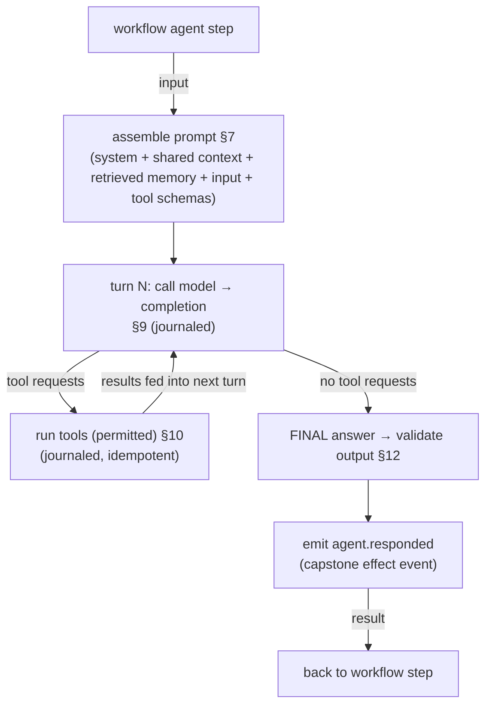
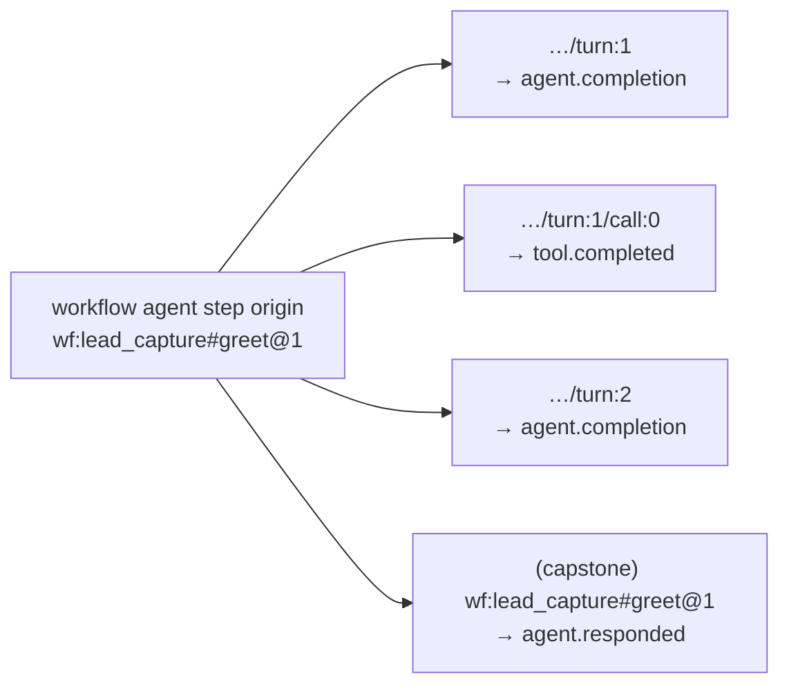
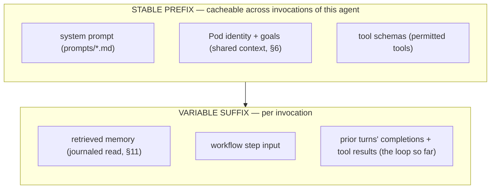

# Agent Runtime

**Status:** Draft · **Spec version:** `podmu.dev/v1` · **Layer:** Core engine

> Builds on [`runtime-arch.md`](runtime-arch.md) (§8 deterministic core /
> journaled effects), [`event-system.md`](event-system.md) (§3, §9 effect
> keying), and [`workflow-engine.md`](workflow-engine.md) (the `agent` step,
> §5/§9). This spec defines how an `agent` effect step actually executes.

---

## 1. Position & Responsibilities

The Agent Runtime executes `agent` steps issued by the Workflow Engine. An
**Agent** is a declared AI worker (domain-model §4); the Agent Runtime is the
machinery that runs one. It assembles the prompt, invokes the model, drives the
tool-use loop, reads/writes memory, validates output, and returns a structured
result to the calling workflow step.

**Owns:** prompt assembly, model invocation, the agent tool-use loop, output
validation, per-agent budgets/guards, and journaling of every internal
non-deterministic step.

**Does NOT:** decide *which* agent runs or *what happens next* — that is the
Workflow Engine (control flow lives only there, workflow §1). Agents act; they
do not orchestrate (§8). Agents also never reach infrastructure directly — only
through capabilities and journaled effects.

---

## 2. Anatomy of an Agent Run

A single `agent` step expands into a loop:



Internally this is itself a mini-orchestration. The next section explains why
that does **not** break the replay guarantee — in fact it uses the same
mechanism recursively.

---

## 3. The Recursive Determinism Insight  *(central)*

**The problem.** An agent run contains multiple non-deterministic model calls
and multiple side-effecting tool calls. If only the *final* `agent.responded`
result were journaled, a crash mid-loop would leave no record, and recovery
would re-run the entire loop — re-invoking the model (different answer) and
**re-executing already-performed tool calls** (e.g. sending the same WhatsApp
message twice). Unacceptable.

**The resolution.** An agent run is **not an atomic effect.** It is a
*deterministic loop over journaled sub-effects* — structurally identical to the
Workflow Engine (workflow §2), one level down:

- Each **model completion** is a journaled effect (`agent.completion`).
- Each **tool call** the agent makes is a journaled effect (`tool.completed`),
  with a provider idempotency key (§10).
- The agent's *control* — which tool to call next — is decided by the model's
  **recorded** completion. On replay, recorded completions drive the same tool
  calls in the same order.

So the agent loop is **pure over `(its journaled completions + tool results)`**,
exactly as a workflow is pure over its events and effects. The same
deterministic-core/journaled-effects pattern recurses. The model and tools are
never re-invoked on replay; their recorded outputs are replayed.

> **Mental model:** Workflow Engine orchestrates Agents and Tools and is
> replayable because their results are journaled. The Agent Runtime orchestrates
> model-turns and Tools and is replayable for the same reason. Determinism is a
> *fractal* property of the system, not a property of one layer.

---

## 4. Effect Keying & Internal Event Types

Internal effects nest under the workflow `agent` step's effect origin
(workflow §9):



| Event | Category | When | Journaled? |
|---|---|---|---|
| `agent.completion` | effect | each model turn | yes — recorded model output |
| `tool.completed` | effect | each tool call inside the loop | yes — recorded tool result |
| `memory.read` result | effect | retrieval feeding the prompt | yes (§11) |
| `agent.responded` | effect | run finishes | yes — the capstone result the workflow consumes |

Deterministic keys (`turn:N`, `call:M`) come from the loop counters, which are
themselves deterministic given the recorded completions — so replay reproduces
the identical key sequence.

---

## 5. Agent Definition Model

An agent is a Definition-plane artifact (`agents/<name>.yaml`), addressed by
`name` within the Pod (domain-model §7):

```yaml
# agents/closer.yaml
agent: closer
role: "WhatsApp sales closer"
model: claude-sonnet-4-6
prompt: prompts/closer.system.md      # system prompt (Definition plane)

tools:                                 # subset of Pod tools; each must be permitted
  - whatsapp.send_message              # (pod-spec permissions.tool_scopes, workflow §15)
  - crm.update_customer

memory:
  read:  [long_term, vector, summarized]   # stores it may retrieve from (§11)
  write: [long_term, event]                # stores it may record to (§11)

params:
  temperature: 0.4
  max_turns: 6                         # loop guard (§13)

budget:
  max_tokens: 20000                    # ties to permissions.spend_limits (§13)

output:
  schema: schemas/closer_output.json   # structured + validated (§12)
```

Validated at LOAD (runtime §4): model known, prompt resolves, every tool exists
and is permitted, memory scopes valid, output schema parses.

---

## 6. Shared Context & Collaboration

All agents in a Pod **share context, goals, memory, and tools** (domain-model
§4). The Agent Runtime injects, into every run:

- the Pod **Identity** (brand, niche, audience, positioning, tone) and **goals**
  (pod-spec §6) — so every agent acts toward the same business objectives;
- access to the **shared Memory** (within the agent's declared scope, §11);
- the **shared tool vocabulary** (within the agent's permitted subset).

**Version coherence (critical).** The identity, goals, and prompts injected are
those of the **same `definition_version` the invoking workflow instance is
pinned to** (workflow §14), *not* the Pod's current Definition. A run invoked by
a long-lived, pinned instance sees that instance's vintage identity/goals — so
it never executes an old plan under new goals. The Definition is one atomic
pinned snapshot; the Agent Runtime reads identity/goals/prompts from it, never
from live Definition.

**Agents do not orchestrate agents (V1).** Control flow lives only in workflows
(workflow §1). An agent cannot invoke another agent — a workflow composes them.
This keeps determinism tractable and the system legible. Agent-to-agent
delegation is **deferred** (§18) and is the same strategic question as
agent-planned workflows (workflow §18).

---

## 7. Prompt Assembly & Caching

The prompt is assembled deterministically from a **stable prefix** and a
**variable suffix** — a split chosen deliberately for prompt caching:



- **Prompt caching is first-class.** Agents are invoked repeatedly with the same
  identity/goals/tool prefix; caching that prefix is a major cost and latency
  lever on the platform. The stable prefix is marked cacheable; the suffix is
  not.
- **Determinism note:** caching is a live-path optimization only. It changes cost
  and latency, never the recorded result. Replay reads journaled completions and
  never touches the model or cache (§14).
- **Assembly is deterministic** given the (journaled) memory reads and inputs —
  required for §3 to hold.

---

## 8. Model Invocation

- Issued through a **model provider capability** (runtime §12), never a raw SDK
  client an agent could widen.
- Each completion is journaled as `agent.completion` (§4). The recorded payload
  follows the event-system large-payload rule (event-system §6): big outputs go
  to object storage with a `payload_ref`.
- **Retries:** transient model errors retry with backoff; each attempt is a
  distinct effect origin (`turn:N@attempt`), individually journaled, so replay
  is unambiguous.
- **Per-run model pinning.** The concrete model version is resolved **once at run
  start** and recorded (`agent.run.started`). Every turn of that run — including
  turns issued live when a *partially-recorded* run **resumes** after a crash
  (§13) — uses the pinned version. This prevents a behavioral shift mid-thought
  when the platform's model is upgraded between a run's start and its resume:
  in-flight runs finish on the model they began with; only *new* runs adopt the
  new version. (Replay never invokes the model, §13, so it is already immune;
  pinning closes the *resume* case.)
- **Structured output:** final answers conform to the agent's `output.schema`
  (§12), typically via the provider's structured-output / tool mechanism so the
  workflow can branch on typed fields.

---

## 9. Tool Use Within Agents

When a completion requests tools:

- Only tools in the agent's `tools` list **and** permitted by
  `permissions.tool_scopes` (pod-spec §6) may be called. A request for any other
  tool is refused and fed back to the model as an error turn — an agent can
  never escape its permissions, even if the model "asks."
- Each call goes through the **Tool Runtime (MCP)** (next spec), journaled as
  `tool.completed` with a provider idempotency key
  (`effect_origin = …/turn:N/call:M`), so a live retry or a replay never
  double-acts on the outside world (event-system §9).
- Tool results are fed into the next turn.

This is why agent side-effects are crash-safe (§3): every external action is an
individually journaled, idempotent effect — not buried inside an opaque run.

---

## 10. Memory Access

- **Reads** (retrieval that feeds the prompt) are journaled effects (`memory.read`,
  §4, runtime §8) — because what the agent retrieved influences its
  non-deterministic output and must be reproducible on replay.
- **Writes** (recording a learning, e.g. "this customer prefers evening
  contact") are effect steps appended to the log and applied to the durable
  store, within the agent's declared `memory.write` scope.
- Scope is enforced from the agent definition (§5); an agent cannot read or
  write a store it didn't declare. Detailed store semantics belong to the Memory
  System spec (next).

---

## 11. Output Contract

- Every agent declares an `output.schema`. The final answer is **validated**
  against it before `agent.responded` is emitted; a schema violation is a
  recoverable failure (retry the final turn, §15).
- Structured output is what lets workflows branch deterministically on agent
  results (`{{ analysis.intent == 'hot' }}`, workflow §8). Free-form text that
  workflows then parse heuristically is disallowed — it would smuggle
  nondeterminism into the deterministic core.

---

## 12. Loop Guards & Budget

| Guard | Source | Behavior on breach |
|---|---|---|
| `max_turns` | agent params (§5) | stop the loop; return best-effort or fault (§15) |
| `budget.max_tokens` | agent + `permissions.spend_limits` (pod-spec §6) | stop before exceeding; fault if no valid output |
| step timeout | workflow `agent` step | the workflow's effect times out; workflow handles via `on_error` (workflow §13) |

Guards prevent runaway tool-use loops and unbounded spend — essential when
agents act autonomously with real budgets.

---

## 13. Replay

On replay (runtime §10, workflow §11), the Agent Runtime is **not driven live**:

1. The workflow reaches the `agent` step and looks up its capstone
   `agent.responded` by effect origin.
2. If recorded → return it directly; the entire internal loop is **skipped**
   (the model and tools are never re-invoked).
3. If the run was only *partially* recorded (crash mid-loop, capstone absent but
   some `agent.completion`/`tool.completed` present) → the loop **resumes** from
   the last recorded turn, replaying recorded completions/tool results and
   issuing only the un-journaled remainder live.

Partial-resume (case 3) is exactly why internal steps are journaled individually
(§3): it lets recovery continue an agent run without repeating its already-
performed, irreversible actions.

---

## 14. Failure Handling

| Failure | Response |
|---|---|
| transient model error | retry with backoff; distinct effect origin per attempt (§8) |
| tool failure inside loop | feed error to the model as a turn, or fail per the tool's retry policy; persistent → fault the step |
| output schema violation | retry the final turn; persistent → fault (§11) |
| `max_turns` / budget exceeded | stop; fault with `agent.failed` if no valid output (§12) |
| provider/model unavailable | the step parks; workflow sees a degraded effect (runtime §14, workflow §13) |

A faulted agent run surfaces to the workflow as a failed `agent` effect, which
the workflow handles with `on_error`/retry (workflow §13) — the Agent Runtime
never decides control flow itself.

---

## 15. Interfaces (contracts, not implementations)

```go
// Implements the runtime Engine interface (runtime §15). Invoked by the
// Workflow Engine to service an `agent` effect step.
type AgentRuntime interface {
    Engine

    // Run executes one agent invocation as a journaled deterministic loop (§3).
    // On replay it returns the recorded capstone or resumes a partial run (§13).
    Run(ctx, AgentRef, Input, EffectOrigin) (Output, []Event, error)
}

type AgentDef struct {
    Name, Role, Model, PromptRef string
    Tools        []string        // permitted subset
    MemoryRead   []MemoryStore
    MemoryWrite  []MemoryStore
    Params       AgentParams      // temperature, max_turns, ...
    Budget       Budget           // max_tokens
    OutputSchema SchemaRef
}

// Model access is a capability (runtime §12); journaled per call (§8).
type ModelProvider interface {
    Complete(ctx, Prompt, CachePolicy) (Completion, error) // live path only; replay skips
}
```

---

## 16. Invariants Summary

1. **Agent run = journaled deterministic loop**, not an atomic effect — the same
   pattern as the Workflow Engine, recursing. §3
2. **Every model turn and every tool call is individually journaled** →
   crash-safe, no double side-effects, partial-resume. §3, §4, §13
3. **Agents act, never orchestrate** — no agent invokes another (V1). §6
4. **Permissions are inescapable** — the model cannot call an unpermitted tool. §9
5. **Memory reads feeding the prompt are journaled.** §10
6. **Structured, validated output** — no heuristic text parsing in the
   deterministic core. §11
7. **Loop guards & budgets bound autonomy and spend.** §12
8. **Replay never invokes the model or tools** — recorded outputs only. §13
9. **Prompt caching is first-class** but live-path-only; it never affects the
   recorded result. §7

---

## 17. Deferred / Open Questions

- **Agent-to-agent delegation** (§6) — strategically important to the
  "autonomous" vision; same question as agent-planned workflows (workflow §18).
  Would require the delegation decision journaled and the determinism boundary
  re-examined. Deferred deliberately, not by omission.
- **Streaming completions** — V1 journals whole completions; streaming partial
  tokens to a UI while keeping the journaled record whole needs a defined
  boundary (stream live, record once).
- **Cache key derivation & invalidation** (§7) — exact stable-prefix hashing and
  how a Definition hot-reload (changed system prompt) invalidates caches.
- **Model version *selection* policy** — per-run pinning (§8) resolves the
  *resume* discontinuity (a run finishes on the model it began with). What
  remains open is the *selection* policy: pin per `definition_version` (model
  upgrades are an explicit, versioned Definition change) vs. float to "latest"
  for new runs. The mechanism (record at run start) supports either.
- **Long-context vs retrieval tradeoff** — how much memory to inline vs retrieve
  (§7, §10); resolve with the Memory System spec.
- **Multi-model agents** — an agent using different models per turn (cheap
  router → strong closer). Deferred; affects cost and journaling granularity.

---

*Next spec in order:* **Memory System** — the store taxonomy (short/long/vector/
summarized/event), how reads are journaled and writes applied, and the snapshot
mechanism that has accumulated as the most-deferred decision across every prior
spec.
