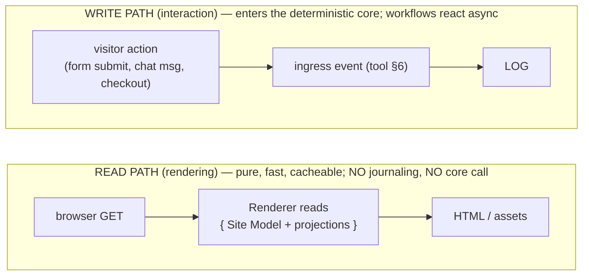
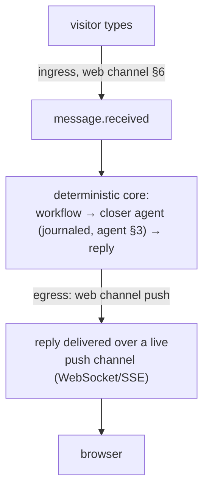

# Frontend Renderer

**Status:** Draft · **Spec version:** `podmu.dev/v1` · **Layer:** Output / projection

> Builds on [`pod-spec.md`](pod-spec.md) (§5 frontend-as-projection),
> [`memory-system.md`](memory-system.md) (projections), [`tool-runtime-mcp.md`](tool-runtime-mcp.md)
> (the channel ingress/egress model), and [`event-system.md`](event-system.md).
> The website is **one output** of a Pod, not its core (Goals.md).

---

## 1. Cardinal Principle

> **The frontend is a projection, never a source of truth.**

Everything below exists to make that *structural* rather than aspirational. The
frontend holds **no** authoritative state. It is rendered *from* the Pod's
Identity, Branding, Knowledge, and Business State; visitor actions enter the
system as **events**, exactly like any other channel. A Pod with no website is
still a complete business — the site is an output, not the organism (Goals.md:
"website generation is only one output").

If at any point the frontend appears to "own" data, that is a design bug.

---

## 2. Three Layers of a Frontend

A frontend decomposes along the two-plane model (pod-spec §2):

| Layer | What it is | Plane | Portable? | Regenerable? |
|---|---|---|---|---|
| **Site Model** | declarative description of the site (pages, sections, bindings, interaction points) | **Definition** (AI-authored) | yes (in the Bundle) | it *is* the regenerated artifact |
| **Rendered output** | actual HTML/CSS/JS/assets served to a browser | ephemeral projection | no (rebuilt on demand) | from Site Model + data |
| **Live data** | catalog, availability, personalized content shown on the page | **State** (business state + memory) | via snapshot | from the log |

The crucial classification: the **Site Model is Definition** (like a workflow or
agent — authored, versioned, diff-able, even though an agent wrote it). The
rendered pages are throwaway. The data is State. Nothing about the frontend is
its own source of truth.

---

## 3. The Site Model

A declarative, generated description the renderer interprets — so the renderer is
**generic** and makes **no hardcoded assumptions** about any business's pages or
layout (system-prompt §5). The per-Pod specifics live entirely in the Site
Model.

```yaml
# (generated) deployments/frontend → site model, a Definition-plane artifact
site_model:
  version: 4
  generated_by: agent:content_creator      # journaled provenance (§4)
  theme: { ref: branding/theme.yaml }        # from Branding (Definition)

  pages:
    - path: /
      sections:
        - type: hero
          content: { headline: "Modest. Premium. You.", cta: "Chat on WhatsApp" }   # static
        - type: product_grid
          bind: { source: business_state.products, limit: 12 }    # LIVE DATA (State, §6)
        - type: personalized_offer
          bind: { source: memory.offer_for_visitor }              # precomputed (§7)
        - type: lead_form
          emits:                                                  # INTERACTION → ingress event (§5)
            on_submit: lead.created
            correlation_key: "{{ form.phone }}"
        - type: chat_widget
          channel: web                                            # bidirectional channel (§5, §8)

  interactions:                              # the site's event surface
    - lead_form   → lead.created
    - chat_widget → message.received
```

Validated at LOAD (runtime §4): theme/binding sources resolve, every `emits`
type is a registered domain event (event §5), interaction correlation keys are
well-formed.

---

## 4. Generation Pipeline

A frontend is **generated**, and generation is ordinary journaled work — no
special path:

1. Intent (owner description, or derived from Identity + goals) triggers a
   **frontend-generation workflow**.
2. Content/design **agents** (`content_creator`, etc.) produce a Site Model from
   Identity + Branding + Knowledge + conversion strategy — every step a journaled
   effect (agent §3, workflow §9).
3. The resulting Site Model is committed as a **new Definition version**
   (`pod_version` bump, pod-spec §9.1).

Consequences of Site Model being Definition:

- **Regenerate the website** = produce a new Site Model version = a Definition
  change applied via **hot reload** (runtime §11). Running sessions are
  unaffected; new requests use the new version.
- **`pod rollback`** restores a prior Site Model version — instant rollback of a
  site redesign (pod-spec §9.4).
- **Diff-able** site history falls out of the Definition versioning for free.

---

## 5. Render-Read / Interact-Emit  *(the structural guarantee, CQRS-flavored)*

The frontend has two strictly separated paths. This split is what *enforces*
§1:



- **Rendering is a read-only projection.** It reads the Site Model and the
  *materialized* projections (business state, memory — memory-system §4) and
  produces pages. It **never** mutates state, never appends events, never blocks
  on the deterministic core. So it is fast, horizontally scalable, and cacheable.
- **Interaction is the only write,** and it writes the *same way everything else
  does* — as an ingress event entering the log (tool-runtime §6), which
  workflows react to asynchronously.

Render reads; interact emits. There is no third path. This is precisely why the
frontend can never become a source of truth: it has no API that writes state
directly — only the event log does.

---

## 6. The Frontend Is a Channel

A visitor-facing site is structurally **another channel**, like WhatsApp or
Instagram (tool-runtime §2) — it has ingress and egress — plus a rendering role
the messaging channels lack:

| Direction | Frontend | (compare WhatsApp) |
|---|---|---|
| **ingress** | form submit → `lead.created`; chat → `message.received` | inbound message → `message.received` |
| **egress** | push reply / live update to the browser (§8) | `send_message` |
| **render** | Site Model → pages (§3) | — |

Modeling it as a channel means the ingress contract (dedupe, correlation,
single-writer append — tool-runtime §6) and egress (a `web` channel binding)
apply unchanged. The Renderer adds only the read-path rendering on top.

---

## 7. Personalization Without Synchronous Core Calls

Personalized content (a tailored offer for a returning lead) seems to demand a
synchronous agent call at render time — which would be slow and would smuggle
non-determinism into the read path. We forbid that. Instead:

- Personalization is **precomputed in the deterministic core**, event-driven:
  when `lead.created` / `visitor.identified` fires, a workflow invokes an agent
  to generate the offer (journaled, agent §3) and **writes it to memory/business
  state** (memory-system §6).
- The render path simply **reads** that precomputed projection
  (`bind: memory.offer_for_visitor`, §3).

So agent cognition runs asynchronously in the core; the page just reflects its
output. The read path stays pure and fast, and all nondeterministic/business
logic stays in the journaled core. (If a personalization isn't ready yet, the
page renders a sensible default — never blocks.)

---

## 8. Real-Time Interaction (Live Chat)

A visitor chatting with a `closer` agent on the site, in real time, composes the
two paths and the channel model:



- Inbound is an ingress event; the agent runs in the core (journaled); the reply
  is an **egress** action on the `web` channel, delivered to the browser over a
  push connection.
- The push connection is **transport only** — it carries already-decided
  results; it holds no authoritative state and can drop/reconnect freely
  (the conversation lives in the log, not the socket).

Identical in shape to a WhatsApp conversation — only the delivery transport
differs. The deterministic core does not know or care which channel a message
came from.

---

## 9. Determinism, Caching, Regenerability

- **Rendering is a pure function** of (Site Model version + bound data
  as-of-read). Given the same inputs it yields the same page → safe to cache and
  CDN-distribute; invalidate on Site Model version change or underlying data
  change.
- **Site Model generation** is journaled (agent effects, §4) → reproducible and
  versioned.
- **Fully regenerable:** rendered output is never authoritative; it can be
  rebuilt any time from Site Model + data. A lost render cache costs latency,
  never data.

---

## 10. Portability

Because the Site Model is Definition-plane (in the Bundle, §2):

- **Export/fork carries the site** — a forked Pod has the original's frontend
  (pod-spec §10).
- **Clone funnels / templates** (Goals.md marketplace) ride on Site Model
  portability: a Site Model with State reset (clone, pod-spec §2.3) is a
  reusable funnel template, decoupled from the original business's data.

---

## 11. Interfaces (contracts, not implementations)

```go
// Read path — pure projection, no journaling, no core mutation (§5).
type Renderer interface {
    Render(ctx, path string, sm SiteModel, data ProjectionView) (Page, error) // pure
    Invalidate(scope CacheScope)                                              // on version/data change
}

// Write path — interactions become ingress events (§5, §6); reuses the
// IngressAdapter contract from tool-runtime §12 (the `web` channel).
type FrontendChannel interface {
    // ingress: a visitor action → normalized domain event (dedupe + correlation)
    OnInteraction(raw WebAction, sm SiteModel) (Event, error)
    // egress: push an already-decided result to a live browser session (§8)
    Push(sessionID string, msg PushPayload) error
}

// Generation — ordinary journaled agent work producing a Definition version (§4).
type SiteModelGenerator interface {
    Generate(ctx, intent Intent, identity, branding, knowledge Refs) (SiteModel, []Event, error)
}
```

---

## 12. Invariants Summary

1. **Frontend holds no authoritative state** — it is a projection. §1
2. **Render reads; interact emits; no third path** — the structural guarantee of
   §1. §5
3. **Site Model is Definition** (AI-authored, versioned, portable); rendered
   output is throwaway. §2, §9
4. **Renderer is generic** — no hardcoded per-business assumptions; specifics
   live in the Site Model. §3
5. **The frontend is a channel** — ingress/egress reuse the Tool Runtime
   contract unchanged. §6
6. **Personalization is precomputed in the core**, never a synchronous render-
   time agent call. §7
7. **Push connections are transport only** — the conversation lives in the log.
   §8
8. **Regenerate = new Definition version**; rollback restores a prior site. §4
9. **Rendering is pure & cacheable**; a lost cache costs latency, not data. §9

---

## 13. Deferred / Open Questions

- **Visitor identity & sessions** — anonymous → identified transition,
  `visitor.identified` semantics, and session↔correlation mapping (§7, §8).
  Intersects PII governance (memory §14, tool-runtime §14).
- **Site Model component vocabulary** — the catalog of `section`/`type`
  primitives the renderer understands, and how new ones are added (built-in vs
  marketplace, paralleling MCP servers).
- **Edge rendering & data freshness** — SSR vs static vs ISR on Next.js, and how
  "as-of-read" data consistency (§9) is bounded at the edge. Operational,
  Stage-2 (overlaps the Deployment spec).
- **Live push fan-out at scale** — WebSocket/SSE infrastructure for many
  concurrent visitors per Pod on the shared fleet. Stage-2.
- **A/B & conversion optimization** — the "continuously optimizes" vision
  (Goals.md) implies the core mutates the Site Model based on conversion events;
  a generation loop driven by analytics. Strategically central; deferred with
  agent-planned workflows (workflow §18).

---

*Next spec in order:* **Deployment** — how a `frontend` (and other) deployment is
provisioned, hosted, and connected to the Pod's namespaces and channels;
completing the V1 spec set.
