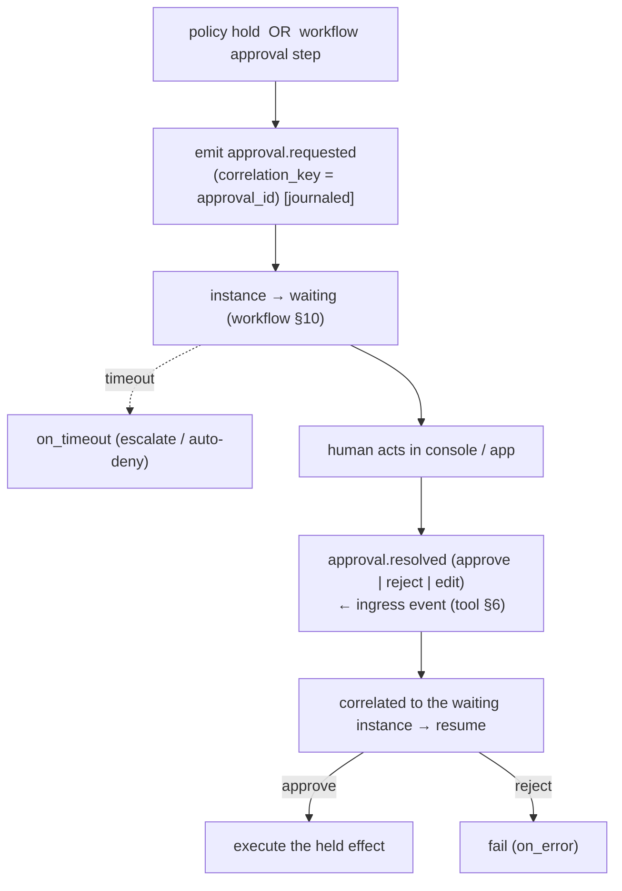

# Governance & Human-in-the-Loop

**Status:** Draft · **Spec version:** `podmu.dev/v1` · **Layer:** Cross-cutting control

> Added in response to architecture review (`Feedback.md` §2, §3, §8.1): an
> autonomous system that moves money and contacts customers needs a first-class
> layer for **hard constraints** and **human intervention** that sits *above*
> agents and workflows. Builds on [`runtime-arch.md`](runtime-arch.md),
> [`workflow-engine.md`](workflow-engine.md), [`agent-runtime.md`](agent-runtime.md),
> [`tool-runtime-mcp.md`](tool-runtime-mcp.md), and [`event-system.md`](event-system.md).

---

## 1. Why This Layer Exists

The core specs make Podmu *autonomous and replayable*. They do **not** make it
*governable*. Today the only controls are local and static: agent loop guards
(agent §12), `permissions.tool_scopes` and `spend_limits` (pod-spec §6), and
workflow `on_error` edges (workflow §13). Missing:

- a way to enforce **hard business constraints** an agent cannot reason around
  ("never refund > $500 without approval", "never message outside 9am–9pm");
- a **human intervention** path — pause, inspect, correct State, resume — for
  when the autonomous system goes wrong (runaway loop, bad decision, anomaly);
- an **audit** surface answering "why did the business do that, and who allowed
  it?"

This spec adds two cooperating constructs: the **Governor** (automated policy)
and the **Intervention Protocol** (human control). Both are built from the same
deterministic primitives as everything else — governance is not a side channel.

---

## 2. Position & Non-Negotiables

- The Governor is **above** the Workflow and Agent engines: it sees every
  *effect request* before it executes and every *lifecycle transition*, and may
  **allow / deny / hold** it.
- Governance decisions are **journaled events** (event §2) — replayable and
  auditable like everything else (§7). A held/approved effect is deterministic
  on replay: the decision is recorded, not re-evaluated against live state.
- The Governor enforces; it does **not** decide business strategy. It is a
  guardrail, not an agent.
- **Hard constraints are inescapable.** Because the Governor gates effects at the
  Tool/Agent boundary (runtime §12 capabilities), an agent cannot talk its way
  past a policy — the policy is checked outside the model's reach, exactly as
  tool permissions are (agent §9).

---

## 3. The Governor (Automated Policy)

A **policy** is a declarative, Definition-plane rule evaluated against an effect
request or lifecycle event. Policies are pure predicates over typed inputs (the
same sandbox class as workflow expressions, workflow §7) — **no I/O, no model
calls** — so evaluation is deterministic and journaled cleanly.

```yaml
# governance/policies.yaml  (Definition plane; pinned per definition_version, workflow §14)
policies:
  - id: refund_cap
    on: tool                          # gate tool effects
    match: "{{ action == 'payments.refund' }}"
    when:  "{{ args.amount_cents > 50000 }}"
    decision: hold                    # allow | deny | hold (→ HITL §4)
    reason: "refund over $500 requires human approval"

  - id: spend_ceiling
    on: tool
    match: "{{ action == 'ads.create_campaign' }}"
    when:  "{{ pod.spend.month_to_date_cents + args.budget_cents > pod.limits.ads_monthly_cap }}"
    decision: deny
    reason: "monthly ad spend cap"

  - id: quiet_hours
    on: tool
    match: "{{ action == 'whatsapp.send_message' }}"
    when:  "{{ clock.local_hour < 9 or clock.local_hour >= 21 }}"
    decision: hold
    reason: "outside permitted contact hours"
```

**Evaluation point.** Before the Tool Runtime executes an egress effect (tool §4
step 1.5) and before an Agent run starts a side-effecting turn, the owning
Runtime evaluates matching policies:

| Decision | Effect |
|---|---|
| `allow` | proceed; journal `policy.allowed` (cheap, may be sampled) |
| `deny` | effect fails with a policy error → workflow `on_error` (workflow §13); journal `policy.denied` |
| `hold` | suspend the effect; emit `approval.requested`; the instance parks in `waiting` (workflow §10) until a human responds (§4) |

`spend.month_to_date` and similar aggregates are read from **business-state
projections** (memory §2), and the *read value* is journaled with the decision so
replay reproduces it (no re-aggregation) — same discipline as a journaled
memory read (memory §5).

---

## 4. Human-in-the-Loop (Intervention Protocol)

HITL is modeled as an **ordinary correlated wait** (workflow §6, §8) — not a new
mechanism. A `hold` (or an explicit `approval` workflow step) parks the instance;
a human decision arrives as an **ingress event** (tool §6), correlated back to
the waiting instance.



- The human decision is an **ingress fact** with an idempotency key (tool §9), so
  a double-click never double-approves.
- An approval has a **timeout** (`on_timeout`) so held effects can't park
  forever — escalate or auto-deny per policy. (This also bounds the
  correlation-index growth the review flags in §5 / workflow §18.)
- Approvals are **journaled** (`approval.requested` / `approval.resolved`), so the
  audit trail (§7) records *who* approved *what*, *when*, and *why*.

---

## 5. State Correction (the "Big Red Button")

Some interventions go beyond approving an effect — a human must **stop the Pod
and correct its State** (an agent recorded a wrong customer fact; a loop must be
killed). This is the most delicate operation in the system because State is an
event-sourced projection (memory §4): you cannot edit a projection directly
without diverging from the log.

**Mechanism — correction is itself a journaled event, never a silent edit:**

1. **Halt.** An operator issues `pod.halt` (a Kernel control action). The Runtime
   drains (runtime §7 DRAINING) and the Pod enters `paused` (pod-spec §4). No
   effects execute while halted.
2. **Inspect.** With the Pod paused, an operator reviews instance positions,
   recent events, and memory/business-state projections (read-only).
3. **Correct.** A correction is appended as a **first-class compensating event**
   (e.g. `memory.corrected`, `instance.cancelled`, `business.adjusted`) carrying
   the operator identity and reason. It is applied to projections like any other
   event — **the log stays append-only and truthful** (event §1). History records
   that a human intervened; it is not rewritten.
4. **Resume.** `pod.resume` returns the Pod to `active`; replay/recovery
   naturally includes the correction because it is in the log.

> **Invariant:** there is no API that mutates a projection out-of-band. Every
> correction is an event. This preserves replay determinism (runtime §8) and the
> audit trail through the most dangerous operation in the system. A "manual fix"
> that bypassed the log would silently break crash recovery — so it is forbidden.

`instance.cancelled` also gives the review's requested kill-switch for a runaway
workflow/agent loop: cancel the instance (a journaled event); its parked
correlation entry is reaped (workflow §18).

---

## 6. Authority & Permissions

- **Who may govern.** Approval and correction rights are scoped to principals
  (Owner, or delegated operators) — an extension of pod-spec §6 `permissions`.
  Not every human may approve a $50k refund.
- **Tiered approvals.** A policy may require *N approvers* or a *specific role*
  (`decision: hold, approvers: 2` / `role: finance`). Deferred detail (§9), but
  the `hold` mechanism (§4) carries the shape.
- **Operator actions are authenticated and attributed** in the journaled event
  (§7); corrections by an unauthorized principal are refused at the Kernel.

---

## 7. Audit

Governance makes the system *accountable*, which falls out for free because every
decision is already an event:

- `policy.allowed` / `policy.denied` / `approval.requested` / `approval.resolved`
  / `memory.corrected` / `instance.cancelled` / `pod.halt` / `pod.resume` are all
  in the permanent event log (event §12 — lifecycle/system retention class).
- "Why did the business issue this refund?" is answered by walking
  `causation_id` (event §10) from the `tool.completed` back through
  `approval.resolved` to the `approval.requested` and the originating policy.
- The audit trail is therefore **intrinsic**, not a bolted-on log — same property
  as business causality (event §10).

---

## 8. Interfaces (contracts, not implementations)

```go
// Evaluated by the owning Runtime before side-effecting effects & on lifecycle
// transitions. Pure predicate; result journaled (§3).
type Governor interface {
    Evaluate(ctx, req EffectRequest, view PolicyView) (Decision, Event) // allow|deny|hold
}

type Decision struct {
    Outcome   Outcome   // Allow | Deny | Hold
    PolicyID  string
    Reason    string
    ReadValues map[string]any // aggregates read, journaled for replay (§3)
}

// Kernel control surface for human intervention (§4, §5). Authenticated &
// attributed; every action is a journaled event.
type Intervention interface {
    Halt(ctx, podID ULID, operator Principal, reason string) error      // §5.1
    Resume(ctx, podID ULID, operator Principal) error                    // §5.4
    Resolve(ctx, approvalID string, d ApprovalDecision, op Principal) error // §4
    Correct(ctx, podID ULID, c Correction, op Principal) (Event, error)  // §5.3 → compensating event
    Cancel(ctx, instanceID string, op Principal) (Event, error)          // §5 kill-switch
}
```

---

## 9. Invariants Summary

1. **Hard constraints are inescapable** — enforced outside the model's reach, at
   the effect boundary. §2, §3
2. **Every governance decision is a journaled event** — replayable, auditable;
   never re-evaluated on replay. §3, §7
3. **HITL is an ordinary correlated wait** — no new mechanism; approvals are
   ingress facts with idempotency and timeouts. §4
4. **State correction is a compensating event, never an out-of-band edit** — the
   log stays append-only and truthful through intervention. §5
5. **Policies are pure predicates** (no I/O/model) — deterministic evaluation. §3
6. **Operator actions are authenticated and attributed.** §6, §7
7. **Audit is intrinsic** — answered by `causation_id` over the log. §7
8. **The Governor enforces; it does not strategize.** §2

---

## 10. Deferred / Open Questions

- **Tiered / multi-party approval** mechanics (N-of-M, role routing, delegation).
  §6 — shape defined, details open.
- **Policy authoring by agents** — if agents generate policies (like workflows),
  validation must prove a generated policy can't *weaken* an owner-set hard
  constraint. Intersects agent-planned behavior (workflow §18, agent §17).
- **Anomaly-triggered holds** — auto-`hold` on statistical anomaly (sudden spend
  spike) needs a detection input the pure-predicate model doesn't have; likely a
  precomputed signal in business state (frontend §7 pattern).
- **Cross-pod governance** — fleet-wide policies set by the platform vs per-Pod
  owner policies, and their precedence. Tied to inter-Pod comms (event §15).
- **Correction & erasure overlap** — `memory.corrected` (§5) and PII erasure
  (memory §14 crypto-shredding) both "remove" data; unify in the State-Plane
  Governance spec.

---

*Companion specs queued from the same review:* **Kernel Fencing & Lease
Management** (split-writer safety, runtime §9/§17), **State-Plane Governance**
(erasure via crypto-shredding, cold-state tiering, snapshot cadence, thick/thin
portability boundary), and **Marketplace Tool Trust** (third-party MCP signing,
tool §14).
