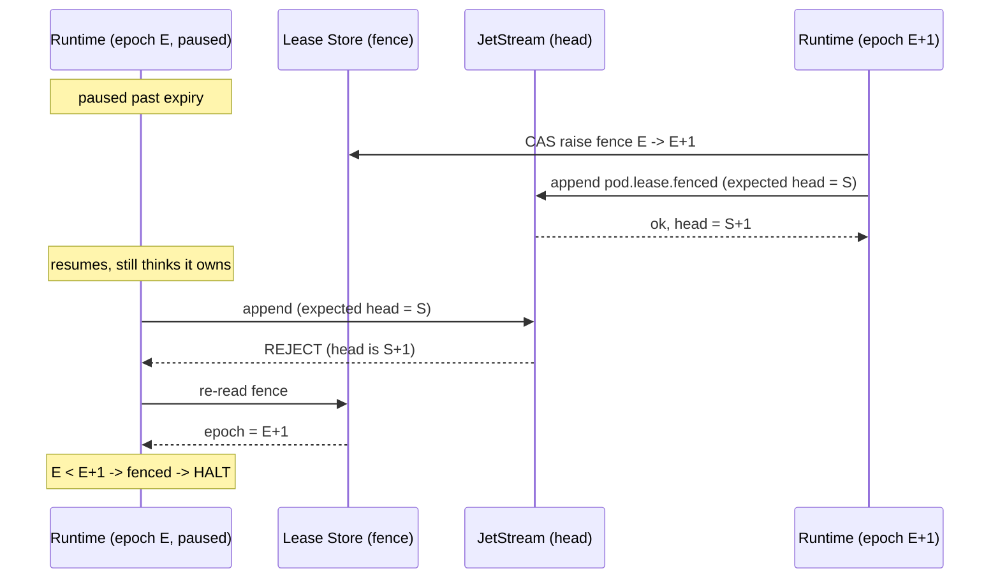

# Kernel Fencing & Lease Management

**Status:** Draft · **Spec version:** `podmu.dev/v1` · **Layer:** Control / correctness

> Added in response to architecture review (`Feedback.md` §2, §7, §8.2). Makes
> concrete the **single-writer invariant** that the whole event-sourced model
> asserts but never specifies: [`runtime-arch.md`](runtime-arch.md) §9/§13/§17,
> [`event-system.md`](event-system.md) §8, [`memory-system.md`](memory-system.md)
> §8. If this protocol is wrong, the event log — the source of truth for
> everything — can fork and corrupt.

---

## 1. The Invariant and the Threat

**Invariant (runtime §9):** at most one logical Runtime is the writer of a Pod's
event log and State at any time. Total per-Pod order (event §8) and deterministic
replay (runtime §8) both depend on it.

**Threat — split-brain.** Two Runtimes simultaneously believing they own the
same Pod, both appending to its JetStream stream, producing a forked/interleaved
history that no replay can make sense of. Causes:

- a network partition between a Runtime and the Kernel;
- a Kernel failover that re-assigns a Pod while the old Runtime is still alive;
- a **process pause** (GC, VM migration, host freeze) that outlasts the lease —
  the old Runtime resumes *after* its lease was reassigned, unaware.

**Why a lease alone is insufficient (the key result).** A time-bounded lease
("you own pod X for 10s") cannot be trusted by the holder, because the holder may
be paused arbitrarily long and wake up with a lease it *believes* is valid but
which has been reassigned. A lock/lease service can never prevent this on its
own. The only sound fix is a **fencing token** the *resource itself* (the data
tier) validates on every write — rejecting any write that carries a stale token,
regardless of what the writer believes. This spec therefore has two cooperating
mechanisms: **leases** (liveness — who *should* write) and **epoch fencing at the
data tier** (safety — who is *allowed* to write).

---

## 2. Leases and Epochs

| Concept | Definition |
|---|---|
| **Lease** | A time-bounded grant of ownership of one Pod to one Runtime, with a TTL, renewable by heartbeat. Governs *liveness* (who should run the Pod). |
| **Epoch** | A **monotonically increasing integer per Pod**, incremented on *every ownership change* (every new grant). The epoch is the **fencing token**. Governs *safety*. |
| **Fence** | The highest epoch the data tier has accepted a write under, held per Pod. Writes with `epoch < fence` are **rejected**. |

A grant is `(pod_id, holder_id, epoch, expires_at)`. Two different Runtimes never
share an epoch; a reassignment always bumps it.

---

## 3. The Lease Store (authority lives in storage, not the Kernel)

The Kernel is the lease *authority*, but lease state must **not** live in a
Kernel process's memory — that would make the Kernel a split-brain source on
failover. Instead it lives in a **strongly consistent, CAS-capable store**:

- **Realization:** a JetStream **KV bucket** `POD_LEASE` (key = `pod_id`, value =
  the grant, with revision-based compare-and-set), or an equivalent Postgres row
  with optimistic versioning. Either gives the one primitive we need:
  **atomic compare-and-set** on the grant.
- **Consequence:** any number of Kernel instances may run for HA; they all
  serialize through CAS on the same store. A Kernel crash loses no lease state;
  another instance reads the same store. "The Kernel" is logically singular,
  physically highly-available (§9).

All grants, renewals, and reassignments are CAS operations against this store.
The store — not any process — is the source of truth for *who holds what at which
epoch*.

---

## 4. Lease Lifecycle

```mermaid
stateDiagram-v2
    [*] --> unheld
    unheld --> held: acquire (CAS grant, epoch E)
    held --> held: renew (heartbeat extends expires_at)
    held --> released: graceful release (drain, §8)
    released --> unheld: epoch retained; next grant = E+1
    held --> expired: TTL elapsed (missed renewals)
    expired --> reassigned: Kernel CAS-grants new holder, epoch E+1
    reassigned --> held: new holder claims (fences + replays §7,§8)
```



- **Acquire.** A Runtime asks the Kernel to activate a Pod. The Kernel CAS-grants
  `(holder, E, now+TTL)` only if currently `unheld`/expired. Epoch from the store,
  incremented.
- **Renew.** The holder heartbeats well inside the TTL (renew interval ≤ TTL/3),
  extending `expires_at` via CAS. Renewal keeps ownership; it does **not** bump
  the epoch.
- **Release (graceful).** On pause/archive/migrate, the holder drains (runtime §7)
  and CAS-clears the grant. The next acquire gets `E+1`.
- **Expire (ungraceful).** Missed renewals → the store's `expires_at` passes. The
  Kernel may CAS-grant a new holder at `E+1`. Reassignment happens **only after
  store-observed expiry plus a skew margin** (§6).

---

## 5. Defense in Depth: Two Layers

Safety does **not** rest on leases alone. Two layers, in priority order:

### Layer 1 — Proactive self-fencing (liveness-friendly, not sufficient)

A Runtime **stops writing on its own** before its lease could be reassigned: if it
cannot confirm a successful renewal by `expires_at − safety_margin`, it
immediately ceases all writes and enters a paused/degraded state (runtime §14).
This makes the *common* cases (transient renewal blips, slow shutdown) safe
without involving the data tier. It is **not** sufficient alone, because a paused
process cannot run its own self-fencing check (it is paused) — which is exactly
the case Layer 2 exists for.

### Layer 2 — Epoch fencing at the data tier (the hard backstop)

The data tier rejects any write carrying `epoch < fence`. This holds **even if
the writer is frozen and wrong about owning the lease**, because the check is at
the resource, not the writer. Layer 2 is mandatory; Layer 1 is an optimization
that narrows reliance on it.

---

## 6. Timing & Clocks

- **No cross-host wall-clock comparison.** Expiry is judged against the **lease
  store's** notion of time (or via relative TTLs the store enforces), never by
  comparing two machines' clocks.
- **Skew margin.** The Kernel waits `TTL + skew_margin` of store-observed silence
  before reassigning, so a holder that self-fences at `expires_at − safety_margin`
  always stops *before* any new holder is granted. Ordering of the safety
  windows: `self-fence (Layer 1) ≤ expires_at ≤ reassign (Kernel)`.
- Layer 2 covers the residual case where Layer 1's ordering is violated by a pause.

---

## 7. Fencing at the Data Tier

Each backing system enforces the epoch fence; the **event log is the critical
one**.

### 7.1 Event log (JetStream) — critical

Two primitives combine:

1. **Epoch fence in the lease store** (§3): the authoritative current epoch.
2. **Optimistic concurrency on append:** every append sets JetStream's
   *expected-last-stream-sequence* to the head the writer last observed. JetStream
   accepts the append only if the stream head still matches.

**Claiming on handoff.** A newly-granted holder (epoch `E+1`), before any normal
write, atomically (a) raises the KV epoch fence to `E+1` and (b) appends a
`pod.lease.fenced{epoch:E+1}` **fencing-marker** event at the current head. From
that moment the head has advanced under `E+1`.

**Why this is safe.** The Kernel never grants `E+1` until the old lease has
expired in the store (§4), by which point the old holder should already have
self-fenced (§5.1). If it did *not* (it was paused):

- its next append carries a stale *expected-last-sequence* (the new holder moved
  the head) → JetStream **rejects** it;
- on that rejection the old holder **must** re-read the epoch fence, find
  `E+1 > E`, conclude it is fenced, and **halt immediately** — never blindly
  retry.

So at most one epoch makes progress past a handoff, and `expected-last-sequence`
guarantees no two appends ever occupy the same position. Optimistic concurrency
alone is **not** enough (two writers can leapfrog distinct positions); the
monotonic epoch is what makes the rejection *permanent*.



### 7.2 Business state (Postgres)

Every Pod write transaction is fenced alongside the existing RLS scoping
(runtime §12): the session asserts its held epoch against a `pod_fence(pod_id,
epoch)` row. A guarded write — `UPDATE pod_fence SET epoch = epoch WHERE pod_id =
$1 AND epoch = $held` returning 0 rows, or an equivalent trigger/`FOR UPDATE`
check — **aborts the transaction** when the held epoch is stale. RLS confines
*which* rows; the epoch guard confines *which epoch* may write them.

### 7.3 Object storage & snapshots

Object writes are content-addressed and idempotent (event §6, memory §8), so a
stale write is harmless. The mutable parts — the *latest-snapshot pointer* and
*checkpoint pointer* — are updated through the fenced lease store / Postgres, so
a fenced writer cannot advance them.

---

## 8. Handoff Scenarios

| Scenario | Sequence |
|---|---|
| **Graceful pause/migrate** | holder drains (runtime §7) → CAS-release → Kernel grants `E+1` to new holder → new holder claims (§7.1) + replays (runtime §10). No fencing needed; epoch bump is bookkeeping. |
| **Crash / partition** | missed renewals → store expiry (+ skew margin) → Kernel CAS-grants `E+1` → new holder fences + replays. Old holder, if alive, self-fenced (§5.1) or is data-tier-fenced (§7) on revival. |
| **Revived zombie** | old holder resumes post-pause, attempts a write → rejected by stale expected-seq / epoch guard → re-reads fence → halts (§7.1). |
| **Two Kernels racing** | both attempt to grant → lease-store CAS admits exactly one; the loser observes the new revision and backs off (§9). |

---

## 9. Kernel HA & Avoiding Kernel Split-Brain

Because all authority is CAS in the lease store (§3), running multiple Kernel
instances is safe **by construction**:

- Grants/renewals/reassignments are CAS ops; concurrent Kernels serialize at the
  store. Only one grant for a given transition wins.
- A Kernel failover mid-grant leaves the store in a consistent state (the CAS
  either committed or didn't); the surviving Kernel reads ground truth from the
  store.
- The Kernel holds **no** authoritative lease state in memory — only a cache it
  must revalidate via CAS before acting.

This directly answers the review's "Kernel failure → split-brain" concern: the
Kernel is not the lock; the store is.

---

## 10. Interaction With the Rest of the System

- **Ordering (event §8):** only the epoch-current writer advances the head, and
  `expected-last-sequence` forbids same-position forks → the total order is
  preserved across handoffs.
- **Replay & recovery (runtime §10):** a new holder replays from the latest
  snapshot/checkpoint (memory §8) and resumes; its appends carry the new epoch.
- **Lease events are journaled:** `pod.lease.fenced`, `pod.lease.granted`,
  `pod.lease.released` are lifecycle/system events (event §2), so ownership
  history is auditable like everything else — and dovetails with the Governance
  audit trail (governance-hitl §7).
- **Snapshots (memory §8):** the snapshotter is a *reader*; it needs no lease, but
  publishing the snapshot pointer is fenced (§7.3).

---

## 11. Interfaces (contracts, not implementations)

```go
// Control tier. All operations are CAS against the lease store (§3).
type LeaseAuthority interface {
    Acquire(ctx, podID ULID, holder RuntimeID, ttl Duration) (Grant, error) // → epoch E
    Renew(ctx, g Grant) (Grant, error)                                       // extends expires_at
    Release(ctx, g Grant) error                                              // graceful (§8)
    // Reassign is internal: only after store-observed expiry + skew (§4, §6).
}

type Grant struct {
    PodID     ULID
    Holder    RuntimeID
    Epoch     uint64        // the fencing token (§2)
    ExpiresAt StoreTime     // store's clock, never local wall-clock (§6)
}

// Data-tier guard — the mandatory backstop (§5.2, §7). Implemented by the
// JetStream append path and the Postgres write path.
type Fence interface {
    Current(ctx, podID ULID) (uint64, error)        // the fence epoch
    Raise(ctx, podID ULID, to uint64) error          // CAS, on claim (§7.1)
    Admit(write FencedWrite) error                    // reject if write.Epoch < fence
}

// The Runtime's obligation (§5.1, §7.1): self-fence proactively, and HALT on any
// fence rejection after re-checking the epoch — never blindly retry.
```

---

## 12. Invariants Summary

1. **At most one epoch makes progress per Pod**; reassignment always bumps the
   epoch. §2, §7
2. **Fencing is enforced at the data tier**, not trusted to the writer — safe
   against arbitrary pauses. §1, §5.2, §7
3. **Authority lives in a CAS store, not Kernel memory** — Kernel HA is safe by
   construction. §3, §9
4. **Kernel grants `E+1` only after store-observed expiry + skew margin.** §4, §6
5. **A new holder claims by atomically raising the fence and landing a fencing
   marker** before any normal write. §7.1
6. **A fenced writer halts on rejection** after re-checking the epoch; it never
   retries into a fork. §7.1
7. **Optimistic concurrency forbids same-position forks; the monotonic epoch
   makes rejection permanent** — both are required. §7.1
8. **No cross-host wall-clock comparison** — expiry is store-authoritative. §6
9. **Lease transitions are journaled** and auditable. §10

---

## 13. Deferred / Open Questions

- **Lease store choice & SLA** — JetStream KV vs Postgres vs a dedicated
  Raft/etcd-class store for the fence; latency of the fence check on the append
  hot path (§3, §7). Needs measurement.
- **Fence-check latency on every append** — the per-append epoch validation must
  not dominate event throughput; likely cached with revision-watch invalidation,
  but the TOCTOU window of any cache needs bounding.
- **TTL / renew-interval / skew-margin tuning** (§6) — trades failover speed
  against false reassignment under load. Operational.
- **Fast failover vs the hydration cliff** — reassignment + replay cold-start
  (Feedback.md §4) must meet real-time-channel SLAs; couples to snapshot cadence
  (memory §14). Consider warm standbys for high-traffic Pods at Stage 2.
- **Postgres fence enforcement mechanism** — trigger vs application guard vs a
  `SECURITY DEFINER` check (§7.2); pick one and make it un-bypassable like RLS.
- **Stage 2/3 dedicated infra** — with dedicated stores per Pod (deployment §10),
  the fence may simplify, but cross-stage *migration* must hand off the epoch
  safely. Deferred with the evolution mechanics.

---

*Companion specs still queued from the review:* **State-Plane Governance**
(erasure via crypto-shredding, cold-state tiering, snapshot cadence, thick/thin
portability) and **Marketplace Tool Trust** (third-party MCP signing, tool §14).
