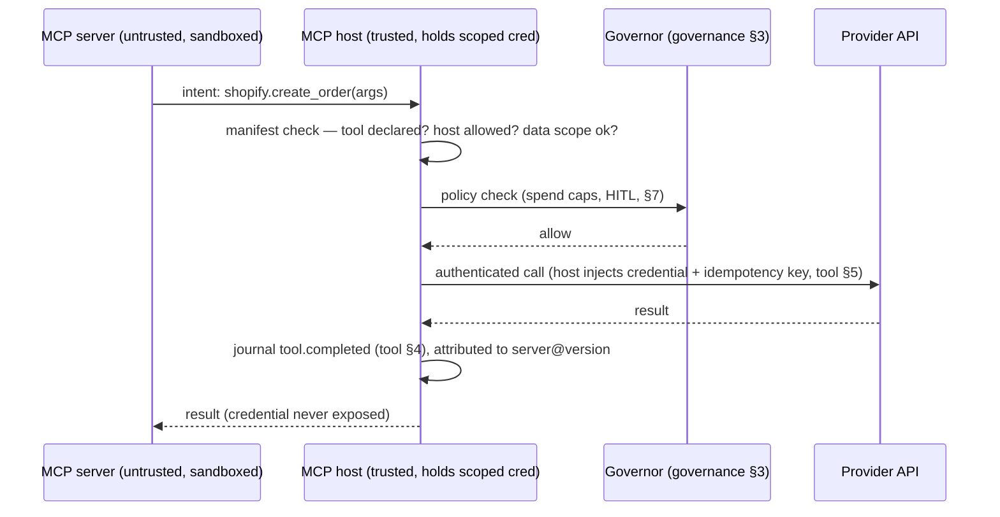

# Marketplace Tool Trust

**Status:** Draft · **Spec version:** `podmu.dev/v1` · **Layer:** Cross-cutting security

> Added in response to architecture review (`Feedback.md` §8.4) and the surface
> flagged in [`tool-runtime-mcp.md`](tool-runtime-mcp.md) §10/§14. Defines the
> trust, signing, capability, and revocation model for **third-party MCP
> servers**. Builds on tool §2/§10/§12, [`governance-hitl.md`](governance-hitl.md),
> [`state-plane-governance.md`](state-plane-governance.md), [`runtime-arch.md`](runtime-arch.md) §12/§13.

---

## 1. Why This Layer Exists

MCP servers are how a Pod reaches the outside world (tool §2). Built-in servers
are Podmu-audited; **marketplace servers are not** — they are third-party code
that a business owner installs to act on the business's behalf. Yet they:

- hold (or use) **scoped provider credentials** — payments, messaging;
- perform **irreversible actions** — move money, message customers;
- **emit ingress events** that drive workflows (tool §6);
- **see customer PII** in payloads (state-plane §2).

This is the system's primary **supply-chain surface**, and — unlike the
Stage-1 Runtime co-location caveat (runtime §13) — it exists at *every* stage,
because the risk is the third-party code itself. A malicious or compromised
server could exfiltrate credentials and customer data, drain funds, spam
customers, inject false facts, or attempt to pivot to other Pods. This spec
bounds that blast radius.

---

## 2. Threat Model

| Threat | Mitigation (section) |
|---|---|
| Credential exfiltration | brokered egress — server never holds the credential (§6) |
| Unauthorized actions (drain funds, spam) | capability manifest + governor policy + tool scopes (§4, §7) |
| Customer-data exfiltration | data-access minimization + PII tagging (§4, §7) |
| False ingress (forged events) | ingress validation against declared event types (§6) |
| Tampered/substituted artifact | signing + provenance verification (§5) |
| Silent privilege escalation via update | version pinning + re-consent on capability change (§8) |
| Cross-Pod pivot | per-Pod sandbox + scoped capabilities (§6, runtime §12) |
| Compromised-after-install server | revocation kill switch (§8) |

The guiding principle: **assume the server is hostile and minimize what it can
touch, see, and do** — defense by capability, not by reputation alone.

---

## 3. Trust Tiers

Trust is **assigned by Podmu review (§5), never self-claimed**, and graduates
what a server may do by default and how much scrutiny it received:

| Tier | Who | Review | Default egress mode (§6) | Default credential access |
|---|---|---|---|---|
| **first-party** | Podmu | full audit, source | injected or brokered | scoped creds |
| **verified-partner** | vetted vendor | manual + automated; identity-verified; DPA signed | **brokered** | brokered only |
| **community** | open publisher | automated + spot review | **brokered**, restricted | brokered only; no money tools without HITL |
| **unverified** | anyone | none — **not installable** without explicit owner override + HITL on every effect | brokered, sandboxed-min | none for money/PII |

Higher tiers may *opt into* tighter controls but never escape the floor for
their tier. Money-moving and PII-handling capabilities require at least
verified-partner, or explicit per-effect human approval (governance §4) below it.

---

## 4. Capability Manifest

Every server ships a **signed manifest** declaring exactly what it does. The
owner **consents** to this manifest at install; the runtime **enforces** it (§6)
— declaration is necessary but not trusted on its own.

```yaml
# mcp-server manifest (published & signed by the author, §5)
mcp_server: acme/shopify-pro
version: 2.3.1
publisher: acme-integrations
trust_tier: verified_partner          # assigned by Podmu review (§3) — not self-asserted

capabilities:
  egress:                              # semantic tools it exposes (tool §2)
    - shopify.create_order
    - shopify.update_inventory
  ingress:                             # event types it may emit (tool §6)
    - order.paid
    - inventory.low
  providers:    [shopify]              # external systems
  network:      [api.shopify.com]      # allowed egress hosts — enforced (§6)
  credential_scope: shopify            # which binding's credential it needs
  data_access:                         # PII classes it will see (state-plane §5.3)
    - identifier                        # customer name/email on orders
    - retained                          # order amounts
  egress_mode: brokered                # brokered | injected (§6)
```

Validated at install and at LOAD (runtime §4): the manifest's `egress`/`ingress`
must be a subset of what the Pod's bindings (tool §3) and
`permissions.tool_scopes` (pod-spec §6) permit; `data_access` is bounded by the
tier (§3); anything undeclared is denied at runtime (§6).

---

## 5. Signing & Provenance

The artifact you run must be the one that was reviewed:

- **Publisher signing.** Servers are signed by their publisher; Podmu verifies
  the signature against a registry of known publisher identities (Sigstore-style
  / content-addressed digest + signature).
- **Manifest is signed with the artifact** — capabilities can't be swapped
  post-review.
- **Version pinning.** A Pod binds a *specific version digest*, not "latest." An
  update is a new artifact that must pass review and (if capabilities changed)
  re-consent (§8). No silent auto-update can ship new code or new powers.
- **Provenance recorded.** The installed server's identity + version digest are
  recorded in the Pod Definition and journaled on use (§9), so every action is
  attributable to an exact reviewed artifact.

---

## 6. Runtime Enforcement  *(the centerpiece: brokered egress)*

Trust tiers and manifests are policy; this is the mechanism that makes them
real. The MCP host (tool §1, runtime §13 security-critical layer) enforces:

### 6.1 Brokered egress — the server never holds the credential

For all non-first-party servers, **the server never receives provider
credentials and never makes the outbound network call itself.** Instead:



The server is reduced to a **translator** (semantic action ↔ provider request
shape). It cannot exfiltrate a credential it never holds, cannot call hosts
outside `network`, and cannot perform tools outside `egress`. This is the single
largest reduction of supply-chain blast radius available, so it is the **default
for every tier above first-party**. (Credential *injection* is permitted only for
first-party servers, where the code is Podmu-audited.)

### 6.2 Sandbox & isolation

- The server runs in a **process/network sandbox** with egress restricted to its
  declared `network` hosts; no ambient filesystem, env, or socket access.
- It is scoped to **one Pod** at a time; co-located servers never share state or
  credentials (mirrors runtime §12/§13). No cross-Pod pivot.

### 6.3 Ingress validation

Events a server emits are accepted **only** if their type is in the manifest's
`ingress` set and permitted by the binding (tool §6). A server cannot forge
arbitrary domain events; an undeclared emit is dropped and flagged.

### 6.4 Data minimization

Only the PII classes in `data_access` (§4, state-plane §5.3) are passed to the
server; everything else is withheld or redacted at the host boundary. A
community-tier server handling orders sees the order, not the full customer
history.

---

## 7. Governance & Policy Integration

Marketplace servers slot into the existing Governor (governance §3) and
State-Plane (state-plane) controls — no parallel machinery:

- Every brokered effect passes the **Governor** before execution (§6.1): spend
  caps, quiet hours, and **`hold` → human approval** (governance §4) apply
  identically to third-party tools. A community-tier server's money action can be
  forced through HITL by policy (§3).
- **PII exposure** to a server is governed by `data_access` (§6.4) + the
  state-plane tagging model (state-plane §2); a server is a *data processor* and,
  for verified-partner+, a DPA is required (§3).
- Server actions inherit **idempotency** (tool §5) and the journaling/replay
  model (tool §4) unchanged.

---

## 8. Revocation & Change Management

- **Kill switch.** Podmu can **revoke** a server (publisher-wide or a specific
  version digest) platform-wide on compromise/abuse. Revocation propagates fast;
  affected bindings are disabled, and dependent workflows **park in `waiting` /
  degrade** (tool §9, runtime §14) — never silently continue.
- **In-flight & replay.** A revoked server's *recorded* past results stay in the
  log, so **replay is unaffected** (tool §4, runtime §8); only *new live* calls
  are blocked. In-flight effects fail into `on_error` (workflow §13).
- **No silent escalation.** A new version requesting capabilities beyond the
  consented manifest (a new tool, a new PII class, a new host) is **blocked until
  the owner re-consents** (§4, §5). Capabilities can shrink silently; they can
  never grow silently.
- **Revocation is journaled** (`tool.server.revoked`) and audited (§9).

---

## 9. Audit & Attribution

- Every brokered effect's `tool.completed` event carries the **server identity +
  version digest** (§5), so "which third-party code did this, on whose
  authority?" is answerable from the log (event §10, governance §7).
- Install/consent, revocation, and capability changes are journaled
  lifecycle/system events (event §2): `tool.server.installed`,
  `tool.server.revoked`, `tool.server.consent_changed`.
- Attribution + the Governor audit (governance §7) + state-plane erasure logging
  (state-plane §8) compose into one accountable trail spanning *who installed it,
  what it was allowed, what it did, and what data it touched.*

---

## 10. Interfaces (contracts, not implementations)

```go
// Registry & admission (control tier). Trust tier is assigned here, not claimed.
type ServerRegistry interface {
    Verify(artifact Digest, sig Signature) (Manifest, error) // §5
    TrustTier(publisher PublisherID) Tier                    // §3 (review outcome)
    Revoke(ctx, target RevokeTarget) (Event, error)          // §8 (publisher | version)
}

// Per-Pod install with explicit owner consent to the manifest (§4, §8).
type ServerInstall interface {
    Install(ctx, podID ULID, m Manifest, consent OwnerConsent) (Binding, error)
    // a version bump with widened capabilities requires fresh consent (§8)
}

// The enforcement boundary (§6) — the security-critical host code (runtime §13).
type BrokeredHost interface {
    // Server emits an intent; host validates manifest, runs Governor (§7),
    // injects credential, calls provider, journals — credential never leaves host.
    Invoke(ctx, server ServerRef, intent ToolIntent, origin EffectOrigin) (Result, Event, error)
    // Ingress accepted only if type ∈ manifest.ingress (§6.3).
    AcceptIngress(server ServerRef, raw Delivery) (Event, error)
}
```

---

## 11. Invariants Summary

1. **Assume the server is hostile** — bound by capability, not reputation. §2
2. **Trust tier is assigned by review, never self-claimed.** §3
3. **Brokered egress: non-first-party servers never hold credentials or make the
   outbound call** — they are translators. §6.1
4. **The capability manifest is enforced at runtime**, not merely declared;
   undeclared tools/events/hosts/PII are denied. §4, §6
5. **Signed, version-pinned artifacts** — no silent code or capability updates.
   §5, §8
6. **Capabilities can shrink silently but never grow silently** — escalation
   requires re-consent. §8
7. **Third-party effects pass the same Governor, idempotency, and journaling** as
   any tool. §7
8. **Revocation parks/degrades, never silently continues; replay is unaffected.**
   §8
9. **Every server action is attributable to an exact reviewed artifact.** §5, §9

---

## 12. Deferred / Open Questions

- **Sandbox technology** — process vs. WASM vs. microVM for MCP servers, and the
  latency cost of brokered egress on the hot path (§6). Implementation choice.
- **Brokering non-trivial auth** — providers with complex/interactive auth
  (OAuth refresh, signed requests) where the host must fully own the auth dance
  for brokering to work (§6.1); some may force `injected` mode and thus a higher
  trust bar.
- **Marketplace economics & DPA tooling** — commerce, payouts, and the legal
  data-processing-agreement workflow (§3, §7) are out of scope here; this spec is
  trust/security only.
- **Reputation & post-install monitoring** — anomaly detection on a server's
  behavior over time (sudden new egress pattern) feeding auto-`hold`
  (governance §10 anomaly hook).
- **Cross-pod / shared servers** — a single server instance serving many Pods for
  efficiency vs. the per-Pod isolation invariant (§6.2). Deferred; default is
  per-Pod isolation.
- **Supply chain of dependencies** — a server's own third-party libraries; SBOM
  requirements per tier.

---

## V1 Spec Set — Complete (incl. review-driven additions)

```
Foundational / core (1–10):  pod · domain-model · runtime · event-system ·
  workflow-engine · agent-runtime · memory-system · tool-runtime-mcp ·
  frontend-renderer · deployment
Cross-cutting (11–14):       governance-hitl · kernel-fencing ·
  state-plane-governance · marketplace-tool-trust
```

All four review-driven specs are now drafted. The one principle still threads
every layer — *nondeterminism pushed to the edge and journaled; everything else
a deterministic projection of an append-only log* — now with explicit
**governance** (human + policy control), **safety** (single-writer fencing),
**data lifecycle** (erasure, tiering, portability), and **supply-chain trust**
(third-party tools) around the deterministic core.
