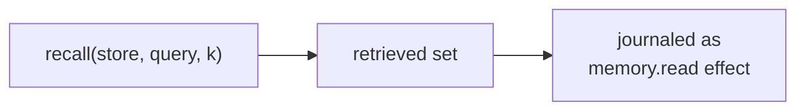
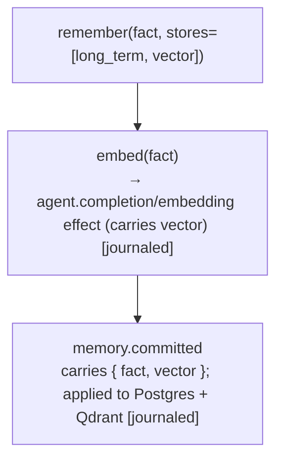

# Memory System

**Status:** Draft · **Spec version:** `podmu.dev/v1` · **Layer:** Core engine

> Builds on [`runtime-arch.md`](runtime-arch.md) (§8, §10), [`event-system.md`](event-system.md)
> (§7 projections, §12 retention), [`workflow-engine.md`](workflow-engine.md)
> (§11 replay), and [`agent-runtime.md`](agent-runtime.md) (§10 memory access).
> **This spec resolves the snapshot mechanism** deferred across all of the above
> (pod-spec §12, runtime §17, event §15, workflow §18, agent §17).

---

## 1. Position & Responsibilities

Memory is the inner core of an AI-native business (Goals.md): customer patterns,
campaign history, conversion insights, learnings. The Memory System provides
read and write access to a Pod's memory stores, journals reads that influence
decisions, applies writes as journaled effects, consolidates memory over time,
and **owns the snapshot mechanism** the rest of the system depends on.

**Owns:** the store taxonomy, recall/commit operations, memory consolidation,
and snapshot/restore.

**Does NOT:** decide *what* to remember or recall — that is agents and workflows.
The Memory System is the substrate, not the cognition.

---

## 2. Three Things People Conflate

| | What it is | Plane | Backing | Regenerable? |
|---|---|---|---|---|
| **Event log** | The Pod's raw, ordered history of facts | State (truth) | JetStream (event §6) | — (it *is* the source) |
| **Memory** | Learned, derived insight over that history | State (projection) | Postgres + Qdrant + object storage | yes, by re-applying journaled writes (§5) |
| **Business state** | Operational domain rows (customers, orders, payments) | State (projection) | Postgres, pod-scoped | yes, from domain events |

All three are State plane (domain-model §4, §8.4). The **event log is the only
truth**; memory and business state are **projections** of it. The distinction
between memory and business state is *policy*, not mechanism (§9): business state
demands exactness and audit; memory tolerates lossiness and compaction.

"Event memory" from Goals.md is **not** a separate store — it is the event log
itself, queried.

---

## 3. Store Taxonomy

The five memory types (Goals.md, pod-spec §6) map to backing systems:

| Store | Purpose | Backing | Rebuild cost |
|---|---|---|---|
| **event** | raw history; "what happened" | event log (JetStream) | n/a (the source) |
| **short-term** | working context for an active case/conversation | fast projection (Postgres/cache), keyed by `correlation_id` | cheap — recent events only |
| **long-term** | durable structured learnings & facts | Postgres, pod-scoped | re-apply journaled writes |
| **vector** | embeddings for semantic recall | Qdrant, collection `pod_<id>` | re-apply journaled writes (embeddings carried, §7) |
| **summarized** | LLM-condensed rollups of history | object storage / Postgres | re-apply journaled writes (summaries carried, §7) |

Short-term is the most projection-like (cheaply rebuilt from recent events);
vector and summarized are the most expensive to *recompute*, which is exactly
why their writes carry the computed artifact (§7) so replay never recomputes.

---

## 4. Memory Is a Projection of Journaled Writes  *(central principle)*

The whole system is event-sourced (event §7): the log is truth, everything else
is a projection. Memory is no exception:

- A memory **write** originates as a journaled **effect** (`memory.committed`).
- The durable store (Postgres row, Qdrant point, summary blob) is updated as the
  **application** of that effect.
- On replay (runtime §10, workflow §11), memory stores are rebuilt by
  **re-applying the journaled write-effects** — *not* by recomputing anything.

This closes a trap. Naively, "rebuild memory by replay" would require re-running
embeddings and LLM summarization — both non-deterministic/expensive, breaking
the determinism guarantee. Instead, **the write-effect carries the computed
artifact** (the embedding vector, the summary text, the structured fact). Replay
re-applies the artifact verbatim. Embeddings and summaries are computed **once**,
live, as their own preceding journaled effects (§7).

> Memory therefore obeys the same law as every other layer: nondeterminism is
> pushed to the edge and journaled; rebuilding is deterministic re-application.

---

## 5. Reads (Recall)

A recall feeding an agent's prompt or a workflow decision is a **journaled
effect** (`memory.read`, agent §10, runtime §8) — because what was retrieved
shapes a non-deterministic output and must be reproducible on replay.



| Store | Recall semantics |
|---|---|
| short-term | recent context for a `correlation_id` (the live conversation) |
| long-term | structured query over facts |
| vector | top-k semantic similarity in `pod_<id>` collection |
| summarized | relevant rollups |
| event | bounded query over the log |

**What is journaled** is the *result* (the retrieved items / their ids + the
content used), not the query mechanics — so replay reproduces the exact set the
agent saw, even though the live store may have grown since. This is essential:
vector search results depend on store contents at read time, which a replay
must not re-derive.

---

## 6. Writes (Commit), Embedding & Summarization

A write is the application of a `memory.committed` effect. When a write needs a
computed artifact, that computation is **its own preceding journaled effect**:



- **Embedding** is treated as a (possibly model-version-dependent) effect: the
  vector is journaled, never recomputed on replay.
- **Summarization** is an LLM effect (agent §3): the summary text is journaled.
- The `memory.committed` effect carries the final artifacts; replay applies them
  directly.
- Writes are scoped to the agent's declared `memory.write` stores (agent §5);
  an agent cannot write a store it didn't declare.

---

## 7. Consolidation (How Memory Compacts)

Unbounded short-term/event history is expensive to carry into prompts. **Memory
consolidation** condenses it — and is itself ordinary, journaled work:

- A scheduled or event-triggered **workflow** (e.g. nightly, or after N events)
  invokes a consolidation **agent** that summarizes recent history into
  `summarized` and promotes durable facts into `long_term`.
- Because consolidation runs through workflows + agents, every step is journaled
  (summaries carried in `memory.committed`, §6) and replay-safe.
- Consolidation is *lossy by design* for memory (insight, not record); it must
  **never** touch business state (which is exact, §9).

This is how a Pod "learns" cheaply over months without its prompts growing
without bound — the marketplace "reuse business intelligence" vision (Goals.md)
rides on consolidated memory being portable in a snapshot (§8).

---

## 8. The Snapshot Mechanism  *(the deferred decision, resolved)*

A **snapshot** is a consistent, point-in-time materialization of **all
projections** pinned to a specific event-log `sequence` S (the *snapshot
horizon*). It is the single mechanism that serves three needs accumulated across
every prior spec.

### 8.1 What a snapshot contains

Everything reconstructable from the log, frozen at S:

- memory stores (short-term, long-term, vector, summarized) as of S;
- business state (pod-scoped Postgres rows) as of S;
- workflow projection: instance positions, correlation index, pending durable
  timers (workflow §11).

The event log itself is **not** copied into a snapshot — the log is truth and
lives in JetStream; a snapshot is its *materialized projection* at S.

### 8.2 Consistency — why S is well-defined

The single-writer + total-order guarantee (runtime §9) makes "the state as of
sequence S" unambiguous: apply all events with `sequence ≤ S`, none after.
Snapshots are taken **online** (no stop-the-world) using each backing store's
consistent-read primitive at the watermark S:

- Postgres: MVCC consistent read at the txn corresponding to S;
- Qdrant: collection snapshot;
- object storage: immutable copy;
- workflow projection: emitted by the engine at S (or replayed from the prior
  snapshot to S — cheap).

The writer keeps appending while the snapshotter materializes; nothing pauses.

### 8.3 Snapshot manifest

```yaml
snapshot:
  pod_id: pod_01HABC
  sequence: 48213                 # the horizon S
  definition_version: 3           # pod_version active at S (workflow §14)
  created_at: 2026-05-29T03:00:00Z
  stores:
    short_term:  { ref: pods/<id>/snapshots/48213/short_term.dump,  hash: ... }
    long_term:   { ref: pods/<id>/snapshots/48213/long_term.dump,   hash: ... }
    vector:      { ref: pods/<id>/snapshots/48213/vector.qsnap,     hash: ... }
    summarized:  { ref: pods/<id>/snapshots/48213/summarized.dump,  hash: ... }
  business_state: { ref: pods/<id>/snapshots/48213/business.dump,   hash: ... }
  workflow:
    instances:         { ref: .../instances.json,        hash: ... }
    correlation_index: { ref: .../correlation.json,      hash: ... }
    timers:            { ref: .../timers.json,           hash: ... }
  verified: true                  # loads + replay S→head reproduces consistent state
```

### 8.4 Verification

A snapshot is `verified: true` only after the Runtime confirms it can be loaded
and that replaying the log from S to head reproduces consistent projections. An
unverified snapshot is never used as a replay base or retention horizon.

### 8.5 Cadence

Periodic (by elapsed time and/or event count) plus on-demand (before
export/fork). Exact tuning is operational (§15); the mechanism is fixed here.

---

## 9. What Snapshots Unlock (closing every deferral)

A verified snapshot at S simultaneously serves the three needs that were
deferred:

| Need | Origin | How the snapshot serves it |
|---|---|---|
| **Replay base** | runtime §10, workflow §11 | recovery loads the snapshot and replays only S→head, not from genesis |
| **Effect-retention horizon** | event §12 | effect payloads with `sequence < S` may be tiered/pruned — they can never be needed again, since recovery never goes before a verified snapshot |
| **Thick-bundle / fork state** | pod-spec §9.3, §2.3 | the snapshot *is* the materialized State plane to embed or copy |

These were one problem wearing four hats. Resolving the snapshot resolves all of
them.

**Memory vs business state in a snapshot.** Both are captured for a consistent S,
but their *retention/compaction policy differs* (§2): business state is kept
exact and audited indefinitely; memory may be aggressively consolidated (§7) and
older detail dropped. The snapshot mechanism is uniform; the policy on top is
not.

---

## 10. Fork / Export / Clone via Snapshots

The two-plane portability operations (pod-spec §2.3) become concrete:

- **Export (thick bundle):** copy the latest verified snapshot's store dumps into
  the bundle's `state/`, plus the event-log tail (or full log for complete
  history). Definition plane copied as authored.
- **Fork (carry state):** copy the snapshot into the *new* Pod's namespaces,
  rewrite `pod_id`, assign a fresh `id` (pod-spec §3); the fork resumes from S.
- **Fork (reset state) / Clone:** copy only the Definition; the new Pod starts at
  genesis with empty memory and business state — a template.
- **Import / restore:** materialize the bundle's embedded snapshot into
  namespaces (idempotently, runtime §5), then replay any embedded log tail past S.

---

## 11. Isolation & Scoping

- Memory access is via capabilities scoped to the Pod's namespaces (runtime §12):
  Qdrant pinned to `pod_<id>`, Postgres under RLS, object storage prefixed
  `pods/<id>/`. No store handle can be widened.
- Agents are *further* scoped to their declared `memory.read` / `memory.write`
  stores (agent §5). A Pod-level capability gates the namespace; the agent
  definition gates which stores within it.

---

## 12. Interfaces (contracts, not implementations)

```go
// Implements the runtime Engine interface (runtime §15). Invoked by Agent
// Runtime and Workflow Engine for recall/commit; owns snapshots.
type MemorySystem interface {
    Engine

    // Recall is a journaled read effect (§5).
    Recall(ctx, store Store, q Query, k int, origin EffectOrigin) (Retrieved, Event, error)

    // Commit applies a journaled write; artifacts (vector/summary) carried in (§6).
    Commit(ctx, write MemoryWrite, origin EffectOrigin) (Event, error)

    // Snapshot/restore (§8, §9, §10).
    Snapshot(ctx, atSequence uint64) (SnapshotManifest, error)
    Verify(ctx, SnapshotManifest) (bool, error)
    Restore(ctx, SnapshotManifest) error
}

type MemoryWrite struct {
    Stores   []Store          // long_term, vector, summarized, short_term
    Fact     StructuredFact
    Vector   []float32         // pre-computed (journaled), if vector store
    Summary  string            // pre-computed (journaled), if summarized store
}
```

---

## 13. Invariants Summary

1. **Log is truth; memory & business state are projections** rebuilt by
   re-applying journaled writes. §2, §4
2. **Write-effects carry computed artifacts** (vectors, summaries) — replay
   never recomputes. §4, §6
3. **Recall results are journaled** so replay reproduces the exact retrieved
   set. §5
4. **A snapshot is a consistent projection pinned to sequence S**, taken online
   via store-level consistent reads. §8
5. **The log is never copied into a snapshot** — a snapshot materializes its
   projection. §8.1
6. **One snapshot serves replay-base, retention-horizon, and export** — they
   were one problem. §9
7. **Effects prune only behind a *verified* snapshot.** §8.4, §9
8. **Memory is lossy/consolidatable; business state is exact** — uniform
   mechanism, divergent policy. §2, §7, §9
9. **Stores scoped by capability *and* by agent declaration.** §11

---

## 14. Deferred / Open Questions

- **Snapshot cadence tuning** (§8.5) — interval/event-count thresholds; balance
  recovery time (replay length) against snapshot cost. Operational, post-V1.
- **Incremental snapshots** — full materialization at large memory volumes is
  costly; CDC/delta snapshots since the last horizon. Carried from pod-spec §12;
  the *mechanism* (§8) admits deltas later without redesign.
- **Embedding-model versioning** — journaled vectors are version-stable for
  replay, but a global re-embed (model upgrade) needs a defined re-projection
  path that doesn't violate replay history.
- **Short-term eviction policy** — when a case goes cold, when to drop short-term
  context (relates to workflow §18 correlation-index GC).
- **Memory privacy / right-to-erasure** — deleting a customer's data conflicts
  with an immutable log. Likely needs crypto-shredding (drop keys for tombstoned
  payloads) rather than log rewriting. Flagged as legally important; deferred.
- **Cross-pod memory in the marketplace** — selling/forking "business
  intelligence" (Goals.md) means exporting consolidated memory while stripping
  PII. Needs a sanitization pass on snapshot export. Deferred.

---

*The seven foundational/core specs are now complete:* pod → domain-model →
runtime → event-system → workflow-engine → agent-runtime → memory-system. *Next
in the original order:* **Tool Runtime (MCP)** — how effect tool calls reach
external systems, the ingress-adapter contract (event §15), and provider
idempotency, after which the **Frontend Renderer** and **Deployment** specs.
