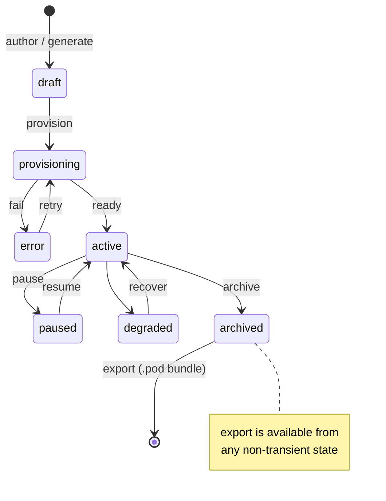

# Pod Specification

**Status:** Draft · **Spec version:** `podmu.dev/v1` · **Layer:** Foundational

> This is the root specification of Podmu. The Pod is the central abstraction;
> the Runtime, Event System, Workflow Engine, Memory System, and Frontend
> Renderer are all defined *in terms of* the Pod. Changes here ripple
> everywhere — treat this document as the source of truth and amend it
> deliberately.

---

## 1. What a Pod Is

A **Pod** is a *portable autonomous business unit*: a serialized, executable
representation of a business that an AI runtime can load, run, pause, fork, and
export.

A Pod is **not** a container, a VM, a Kubernetes pod, or a database tenant.
Those are infrastructure primitives. A Pod is a **business cognitive boundary** —
the unit of identity, memory, intent, and autonomous action.

The mental model:

| Familiar pair | Podmu equivalent |
|---|---|
| Docker image + daemon | **Pod Bundle** + **Pod Runtime** |
| Git repository + execution engine | **Pod Definition** + **Pod Runtime** |
| Process image + OS scheduler | **Pod** + **Podmu Kernel** |

A Pod is data-at-rest (a **Bundle**) until a **Runtime** loads it; the Runtime
is never part of the Pod. This separation is mandatory (see §10).

---

## 2. The Two-Plane Model (Core Invariant)

Every Pod is composed of two cleanly separated planes. **All other structures
in this spec are an expression of this split.**

### 2.1 Definition Plane — *authored, versioned*

The "source code" of the business. Human- or AI-authored, declarative,
diff-able, and versioned like a Git tree. Deterministic: the same definition
loaded into a compatible runtime yields the same behavior.

Contains: identity, agent definitions, workflow definitions, tool bindings,
prompts, branding, knowledge, deployment descriptors, permissions.

### 2.2 State Plane — *accumulated, snapshotted*

The "data" the business has accrued by being run. Append-mostly, large,
non-deterministic, and meaningful only relative to a definition version.

Contains: memory (short/long/vector/summarized/event), analytics, business
state, the event log.

### 2.3 Why this matters

Every portability operation is defined by how it treats the two planes:

| Operation | Definition plane | State plane |
|---|---|---|
| `version` | new monotonic version of the tree | snapshot reference pinned to that version |
| `rollback` | restore prior definition version | restore (or reset to) the paired snapshot |
| `fork` | **copied** (new identity, lineage link) | **choice**: carry, snapshot, or reset |
| `clone` | copied as a template | reset (fresh business) |
| `export` | always included | optional (thick vs thin — §9.3) |

Without this split, "fork a business but start its customer memory fresh" has no
well-defined meaning. With it, it's just *copy Definition, reset State*.

---

## 3. Pod Identity

| Field | Rule |
|---|---|
| `id` | Immutable, globally unique (ULID). Assigned by the Runtime at provisioning. Never reused, never changed — survives renames and version changes. |
| `slug` | Human-readable, unique **per owner**. Mutable. Used in URLs and CLI. |
| `owner_id` | Current owning principal. May transfer; transfer is an audited event. |
| `lineage.parent_pod_id` | For forks/clones: the source Pod's `id`. `null` for originals. |
| `lineage.forked_from_version` | The source Pod's definition version at fork time. Enables provenance and diffing against ancestry. |

**Identity invariant:** a fork produces a *new* `id`. Lineage is recorded, never
inherited. Two Pods never share an `id`.

---

## 4. Lifecycle

A Pod moves through a small set of explicit states. The Runtime owns these
transitions; they are **State-plane status**, never authored into the manifest.



| State | Processing events? | Definition mutable? | Notes |
|---|---|---|---|
| `draft` | no | yes | Being designed/generated. No namespaces allocated. |
| `provisioning` | no | locked | Runtime allocating namespaces (§8). Transient. |
| `active` | yes | hot-reload only | Normal operation. |
| `paused` | no | yes | State preserved; event intake suspended (buffered upstream). |
| `degraded` | partial | hot-reload only | Some subsystem (a tool, a deployment) unhealthy; core continues. |
| `error` | no | yes | Provisioning or fatal runtime failure; requires intervention. |
| `archived` | no | yes | Cold. State snapshotted. Exportable. No live namespaces. |

**Invariant:** event processing occurs **only** in `active` (and partially in
`degraded`). State transitions are themselves emitted as events
(`pod.lifecycle.*`).

---

## 5. Layer Specifications

A Pod's Definition is organized into layers. Each layer has a single
responsibility, a fixed plane, and an isolation namespace.

| Layer | Plane | Responsibility | Isolation namespace |
|---|---|---|---|
| **Identity** | Definition | Brand, niche, audience, positioning, tone, goals. The "who/why." | — (manifest) |
| **Agents** | Definition | Declarations of AI workers (role, model, prompt, tool access, memory scope). | per-agent context |
| **Workflows** | Definition | Event-driven automation graphs. Resumable, replayable. | per-workflow execution |
| **Tools (MCP)** | Definition | Semantic action bindings to external systems via MCP. | per-binding credentials |
| **Branding** | Definition | Visual/voice assets consumed by the Frontend Renderer. | storage scope |
| **Knowledge** | Definition | Curated business knowledge (products, policies, FAQs). Feeds vector memory. | vector scope |
| **Deployments** | Definition | Descriptors for renderable/runnable outputs (frontend, backend, workers). | per-deployment |
| **Permissions** | Definition | What the Pod and its agents may do; tool scopes; spend limits. | — (manifest) |
| **Memory** | **State** | Short/long/vector/summarized/event memory. Business cognition over time. | memory + vector scope |
| **Analytics** | **State** | Derived metrics, conversion insights, learning signals. | analytics scope |
| **Business State** | **State** | Live domain data (leads, orders, conversations) keyed by `pod_id`. | postgres scope |

### Layer notes

- **Identity** is consumed by every agent and by the Frontend Renderer. It is
  the smallest, most stable layer and the seed from which generation flows.
- **Agents** *declare* behavior; they do not contain execution logic. The
  Agent Runtime (separate spec) executes them. All agents in a Pod share the
  Pod's context, goals, memory, and tools — agents are intra-Pod collaborators,
  not isolated services.
- **Workflows** are the only place control flow lives. Agents act; workflows
  orchestrate. A workflow reacts to events and may invoke agents and tools.
- **Tools** expose *semantic* actions (`send_message`, `create_invoice`,
  `publish_post`) — never raw API shapes. The MCP layer hides provider detail.
- **Frontend is a projection** of Identity + Branding + Knowledge + Business
  State. It is never the source of truth and must not be authored as such.

---

## 6. `pod.yaml` — Canonical Manifest

`pod.yaml` is the **root of the Definition plane**. It carries `metadata` and
`spec` only. It deliberately does **not** carry runtime `status` — status is a
Runtime projection (§4), not portable authored content.

```yaml
apiVersion: podmu.dev/v1
kind: Pod

metadata:
  id: pod_01HXYZA8K3QF6T7N9V2BCD4EFG   # immutable, runtime-assigned (ULID)
  slug: nur-atelier                     # human-readable, unique per owner
  owner_id: usr_01H...
  created_at: 2026-05-29T00:00:00Z
  lineage:
    parent_pod_id: null                 # set on fork/clone
    forked_from_version: null
  labels:                               # free-form; powers search/marketplace
    industry: fashion
    channel: whatsapp

spec:
  pod_version: 1                        # monotonic; bumped on definition change
  runtime:
    min_version: "1.0"                  # compatibility contract (§10.1)

  identity:
    brand: Nur Atelier
    niche: Muslim Fashion
    audience:
      age_range: "25-35"
      gender: female
    positioning: premium_modest_wear
    tone: elegant
    goals:
      - increase_whatsapp_sales
      - improve_repeat_orders

  agents:                               # refs into agents/ (Definition plane)
    - ref: agents/strategist.yaml
    - ref: agents/marketer.yaml
    - ref: agents/closer.yaml

  workflows:
    - ref: workflows/lead_capture.yaml
    - ref: workflows/wa_followup.yaml

  tools:                                # MCP bindings; secrets are referenced, never inlined
    - name: whatsapp
      provider: whatsapp_cloud
      credentials_ref: secret://pod/nur-atelier/whatsapp
    - name: payments
      provider: xendit
      credentials_ref: secret://pod/nur-atelier/xendit

  memory:
    stores: [short_term, long_term, vector, summarized, event]

  deployments:
    - kind: frontend
      ref: deployments/frontend.yaml

  permissions:
    tool_scopes:
      whatsapp: [send_message, read_message]
      payments: [create_invoice]
    spend_limits:
      ads_monthly_cap_usd: 0            # explicit zero = disabled
```

**Manifest rules**

- `metadata.id` and `metadata.created_at` are Runtime-assigned and never edited
  by authors.
- All secrets are **referenced** (`secret://…` / `credentials_ref`), never
  embedded. A bundle must be safe to share without leaking credentials.
- Layer bodies may be inlined (as `identity` above) or referenced via `ref`
  (as `agents`/`workflows`). References resolve relative to the bundle root.

---

## 7. Pod Bundle — On-Disk Format

A Pod Bundle is the serialized Pod. It is a directory (canonical) or a `.pod`
archive (zip of that directory). The directory layout makes the two-plane model
physically visible.

```text
nur-atelier.pod/
│
├── pod.yaml                       # Definition root (manifest)
│
├── identity/                      # ── DEFINITION PLANE ──
│   └── audience.yaml              #    authored, versioned, diff-able
├── agents/
│   ├── strategist.yaml
│   ├── marketer.yaml
│   └── closer.yaml
├── workflows/
│   ├── lead_capture.yaml
│   └── wa_followup.yaml
├── prompts/
│   └── closer.system.md
├── tools/
│   └── bindings.yaml
├── branding/
│   ├── logo.svg
│   └── theme.yaml
├── knowledge/
│   └── products.md
├── deployments/
│   └── frontend.yaml
│
├── state/                         # ── STATE PLANE ──
│   ├── memory/                    #    accumulated, snapshotted
│   │   ├── short_term.json
│   │   ├── long_term.json
│   │   ├── summarized.json
│   │   └── vector/                #    embedded vectors OR a thin reference (§9.3)
│   ├── events/
│   │   └── log.ndjson             #    event-sourced history (newline-delimited)
│   ├── analytics/
│   │   └── conversion_insights.json
│   └── business_state.json        #    snapshot of pod-scoped domain rows
│
└── .podmeta/                      # ── META ──
    ├── bundle.lock                #    content hashes per file; integrity + dedup
    ├── version_history.json       #    definition version log (§9.1)
    └── manifest.sig               #    optional signature over bundle.lock
```

**Bundle rules**

- The Definition plane must be fully reconstructable from the bundle alone.
- The State plane may be **embedded** (thick bundle) or **referenced** (thin
  bundle pointing at live namespaces) — see §9.3.
- `.podmeta/bundle.lock` content-addresses every file so integrity, diffing,
  and deduplication don't require parsing layer semantics.

---

## 8. Namespace Contract

Isolation is **logical first** — Pods share infrastructure but never share
namespaces. A Pod owns one namespace per backing system, all keyed off
`metadata.id`:

```text
postgres_scope: pod_id column + row-level security policy
vector_scope:   collection/namespace = pod_<id>
queue_scope:    NATS subject prefix   = pod.<id>.>
storage_scope:  object prefix         = pods/<id>/
```

Row-level isolation pattern (from `Goals.md`, normative for V1):

```sql
-- every business-state table carries pod_id
CREATE POLICY pod_isolation ON customers
USING (pod_id = current_setting('app.current_pod')::uuid);
```

**Namespace invariant:** no Pod may read or write outside its namespaces. The
Runtime sets `app.current_pod` (and the equivalent for each system) per
execution context. A Pod cannot widen its own namespace.

---

## 9. Versioning & Portability Contract

### 9.1 Definition versioning

`spec.pod_version` is a **monotonic integer**, bumped on any committed change to
the Definition plane. `.podmeta/version_history.json` records, per version: the
bundle.lock hash, author/agent, timestamp, and a summary. This makes the
Definition plane a linear, auditable history (a "Business Git" foundation).

### 9.2 Spec/format versioning

`apiVersion` (`podmu.dev/v1`) is the **bundle format** version, independent of
`spec.pod_version`. The Runtime advertises which `apiVersion`s it can load and
honors `spec.runtime.min_version`. Loading rules:

- Runtime `>= min_version` **and** `apiVersion` supported → load.
- Otherwise → refuse with a migration hint. **Never silently best-effort.**

### 9.3 Thick vs thin bundles

| | Thick bundle | Thin bundle |
|---|---|---|
| State plane | embedded in `state/` | references to live namespaces |
| Use case | export, transfer, archive, marketplace | running Pod on shared infra |
| Portability | fully self-contained | requires originating Runtime/infra |

`export` defaults to **thick** (portable). Operational Pods are **thin**
(state lives in shared Postgres/Qdrant/NATS/object store per §8).

### 9.4 Portability operations

Defined entirely by the two-plane table in §2.3. Summary of identity effects:

- **`export`** → write a (thick) bundle. No identity change.
- **`import`** → validate compatibility (§9.2), then provision (`draft` →
  `provisioning`). Importing a bundle that retains its original `id` is a
  *restore*; importing as new assigns a fresh `id`.
- **`fork`** → new `id`, `lineage` set, Definition copied, State per choice.
- **`clone`** → like fork but State reset; intended for templates/marketplace.
- **`rollback`** → restore Definition to a prior `pod_version`; pair with the
  matching State snapshot or an explicit reset.

---

## 10. Runtime / Bundle Separation (Invariant)

- A **Pod Bundle** is inert serialized state. It contains no execution engine.
- A **Pod Runtime** executes a Bundle. It is never serialized into the Bundle.
- The same Bundle on two compatible Runtimes must behave equivalently
  (determinism of the Definition plane; State differences are expected and
  carried in the bundle).

### 10.1 Compatibility contract

The only coupling between Bundle and Runtime is the version handshake in §9.2.
There is no other implicit dependency. A Bundle must declare everything it needs
(tool bindings, deployment descriptors, min runtime version) explicitly.

---

## 11. Invariants Summary

These must hold at all times; downstream specs may rely on them.

1. **Two planes.** Every Pod separates Definition (authored, versioned) from
   State (accumulated, snapshotted). §2
2. **Immutable identity.** `id` is unique, assigned once, never reused; forks
   get new `id`s with recorded lineage. §3
3. **Status is not authored.** Lifecycle/status is a Runtime projection, absent
   from `pod.yaml`. §4, §6
4. **Logical isolation.** A Pod confines itself to its namespaces and cannot
   widen them. §8
5. **Explicit compatibility.** Bundles load only on declared-compatible
   runtimes; no silent degradation. §9.2
6. **Runtime is never in the Bundle.** §10
7. **No inlined secrets.** Bundles are safe to share. §6
8. **Frontend is a projection,** never a source of truth. §5

---

## 12. Deferred / Open Questions

Tracked here so they don't leak into V1 prematurely:

- **State snapshot granularity** — full snapshot vs incremental/CDC for large
  vector + event stores. (Affects fork/rollback cost.)
- **Cross-pod references** — marketplace pods that depend on shared workflow
  libraries: vendored into the bundle, or referenced? (Default for now:
  vendored — preserves portability invariant.)
- **Definition merge/3-way diff** — needed for forks that later pull upstream
  changes. Deferred until fork lineage is exercised.
- **Signing/trust model** — `.podmeta/manifest.sig` is reserved but the trust
  chain (who signs, who verifies on import) is unspecified.
- **Multi-runtime concurrency** — can two Runtimes load the same thin Pod? V1
  answer: no (single active Runtime per Pod). Revisit at Stage 2/3 evolution.

---

*Next specs derive from this one, in order:* domain model & glossary → runtime
architecture → event system → workflow engine → agent runtime → memory system →
tool runtime (MCP) → frontend renderer.
