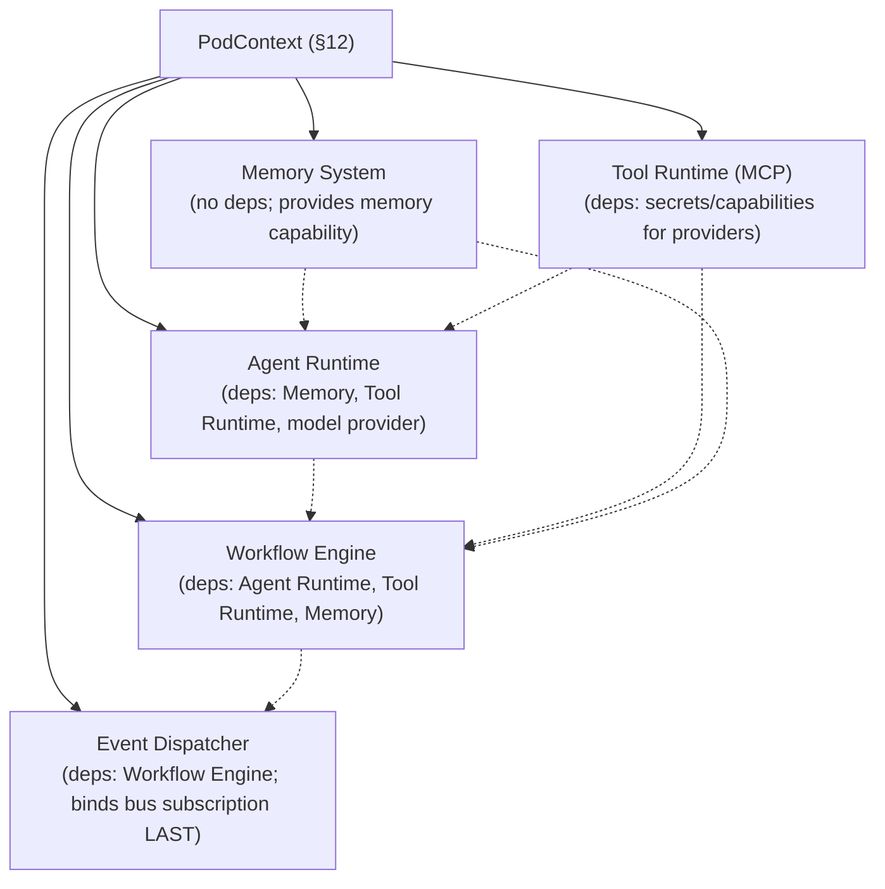
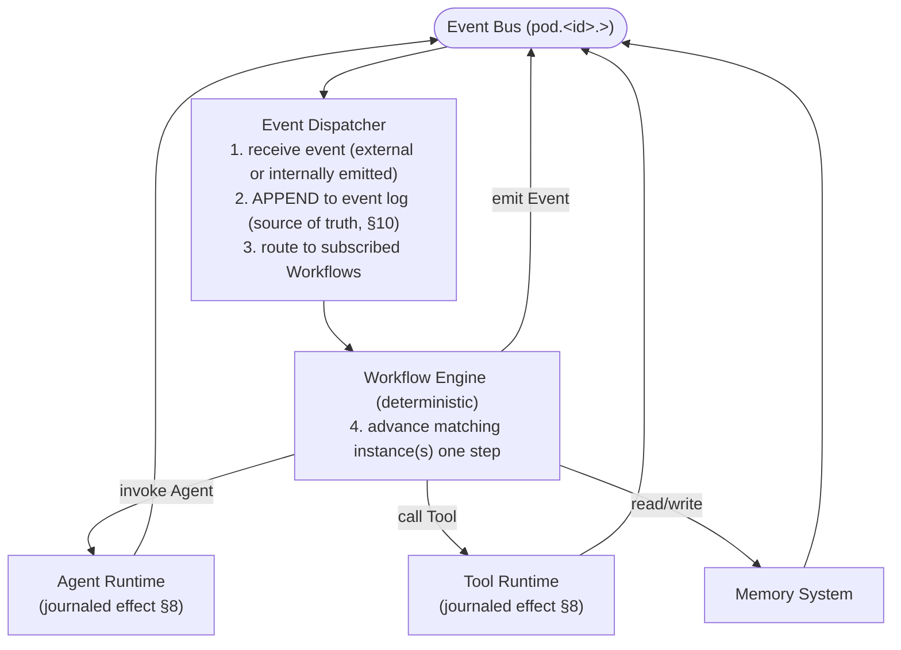
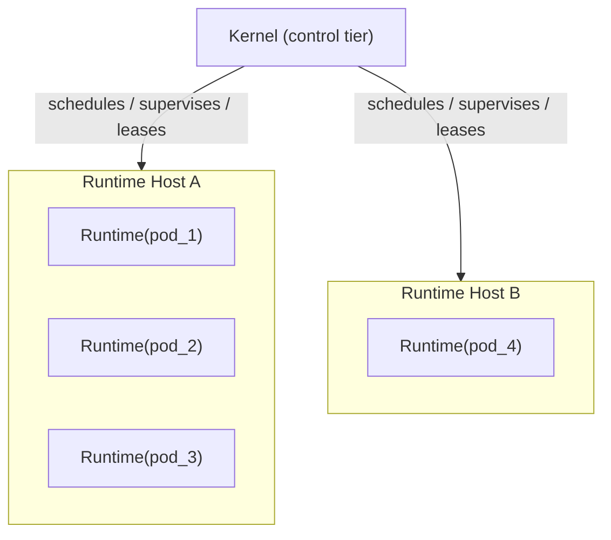

# Pod Runtime Architecture

**Status:** Draft · **Spec version:** `podmu.dev/v1` · **Layer:** Foundational

> Builds on [`pod-spec.md`](pod-spec.md) and [`../domain-model.md`](../domain-model.md).
> This spec defines the **Execution tier**: how a Runtime loads a Bundle,
> hydrates its State plane, wires its engines, runs the event loop, and enforces
> isolation. It defines *interfaces, responsibilities, lifecycle, and
> boundaries* — not implementations.

---

## 1. Position & Responsibilities

A **Pod Runtime** is the logical execution context for exactly one `active`
Pod. The Kernel provisions and supervises it; it is never serialized into a
Bundle (Pod spec §10).

**The Runtime owns:**

- Loading and validating a Bundle (§4).
- Hydrating the State plane and binding the Pod's namespaces (§5).
- Instantiating and wiring the engines (§6).
- Running the event loop that drives all business activity (§7).
- Enforcing the namespace contract on every engine operation (§12).
- Graceful drain, crash recovery via replay, and hot reload (§10–11).

**The Runtime does NOT:**

- Decide *which* Pods run, or *where* — that is the Kernel (Control tier).
- Contain business logic — that lives in Workflows and Agents (Definition).
- Reach any infrastructure outside the Pod's namespaces.
- Persist its own identity — it is disposable and reconstructable from the
  Bundle + the event log.

> **Core property:** a Runtime is *stateless about itself*. Everything
> authoritative lives in the Definition (the Bundle) or the State plane (durable
> infra + event log). A Runtime can die and be rebuilt with no information loss.

---

## 2. Engines

The Runtime hosts five engines (domain-model §6). They share one **PodContext**
(§12) and communicate **only** through events and that context — never by direct
reference to each other's internals.

| Engine | Drives | Determinism |
|---|---|---|
| **Event Dispatcher** | bus I/O, event persistence, routing to workflows | deterministic |
| **Workflow Engine** | orchestration graphs; resumable instances | **deterministic (replayable)** |
| **Agent Runtime** | LLM invocation, agent tool-use loop | **non-deterministic (journaled)** |
| **Tool Runtime (MCP)** | external side-effecting actions | **non-deterministic (journaled)** |
| **Memory System** | read/write memory stores | durable; reads journaled (§8) |

The determinism column is the crux of the whole architecture — see §8.

---

## 3. Runtime Phases & Mapping to Pod Lifecycle

The Pod lifecycle (Pod spec §4) is authoritative *status*. Internally, a Runtime
moves through phases during a Pod's active period:

```mermaid
stateDiagram-v2
    [*] --> LOAD: Kernel Provision(pod)
    LOAD --> error: fail
    LOAD --> HYDRATE: read+validate bundle (§4)
    HYDRATE --> error: fail
    HYDRATE --> WIRE: bind namespaces, restore/replay (§5,§10)
    WIRE --> READY: instantiate + connect engines (§6)
    READY --> RUNNING: Kernel Activate
    RUNNING --> RUNNING: hot reload (§11), degraded recovery (§14)
    RUNNING --> DRAINING: Kernel Pause/Archive
    DRAINING --> STOPPED: finish in-flight, flush, checkpoint
    STOPPED --> [*]: release handles; process exits

    note right of READY
        subscriptions live,
        nothing dispatched yet
    end note
    note right of RUNNING
        the event loop (§7)
    end note
```



| Runtime phase | Pod status | Event processing |
|---|---|---|
| LOAD, HYDRATE, WIRE | `provisioning` | no |
| READY | `provisioning` | subscribed, not dispatching |
| RUNNING | `active` (or `degraded`) | yes |
| DRAINING | `paused` / `archived` (transition) | finishing in-flight only |
| STOPPED | `paused` / `archived` | no |
| (LOAD/HYDRATE failure) | `error` | no |

---

## 4. Bundle Loading & Compatibility

LOAD is read-only and side-effect-free. Steps:

1. **Resolve & read** the Bundle (directory or `.pod` archive).
2. **Integrity check** against `.podmeta/bundle.lock` content hashes.
3. **Compatibility handshake** (Pod spec §9.2): the Runtime supports the
   Bundle's `apiVersion` **and** Runtime version `>= spec.runtime.min_version`.
   On mismatch → **refuse with a migration hint**. Never best-effort.
4. **Parse & validate** the Definition plane: manifest, agent/workflow/tool
   references resolve, permissions well-formed, secret refs resolvable (handles
   only — values are fetched lazily via the secrets broker, never cached in the
   Bundle or logs).
5. Produce an immutable in-memory **Definition** object. The Definition is
   frozen for the Runtime's life except via explicit hot reload (§11).

LOAD never writes to any namespace. A failed LOAD leaves no trace.

---

## 5. State Hydration

HYDRATE makes the State plane available and binds the Pod's namespaces. Behavior
depends on bundle materialization (Pod spec §9.3):

**Thin bundle (operational, the common case).** State already lives in shared
infra under the Pod's namespaces. Hydration:

1. Acquire **scoped capabilities** for each backing system (§12) — never raw
   connections.
2. **Restore the durable horizon:** Postgres business state and Qdrant vectors
   are already durable; nothing to load.
3. **Rebuild volatile execution state** by replaying the event log from the last
   durable checkpoint (§10) — this reconstructs in-flight Workflow instances.

**Thick bundle (import/restore).** State is embedded in `state/`. Hydration
first **materializes** embedded memory/business-state/events *into* the Pod's
namespaces (idempotently, keyed by `pod_id` and `event_id`), then proceeds as
the thin case. Importing as a new Pod assigns a fresh `id` and rewrites scopes
accordingly.

Hydration is **idempotent**: re-running it (e.g. after a crash mid-import)
converges to the same state.

---

## 6. Engine Wiring

WIRE instantiates engines in dependency order and hands each the shared
PodContext. Engines are inert until READY and dispatching only in RUNNING.



The Event Dispatcher subscribes **last**, so no event is delivered before every
downstream engine is ready. Engines never hold references to one another's
internals; cross-engine effects happen via the PodContext capabilities and via
events.

---

## 7. The Execution Loop

The Runtime is fundamentally an **event loop** bound to the Pod's subject scope
`pod.<id>.>`. One iteration ("tick"):



Properties:

- **Everything is an event.** Agent outputs, tool results, memory commits, and
  lifecycle changes all surface as events appended to the log. The log is the
  Pod's authoritative history (event sourcing).
- **The loop is the only mutator** of the Pod's State (single-writer, §9).
- Lifecycle transitions are themselves events (`pod.lifecycle.*`).

---

## 8. Deterministic Core vs Journaled Effects  *(central commitment)*

**The tension:** the Pod spec requires Workflows to be *resumable and
replayable*, but Agents and Tools are non-deterministic — an LLM call or a
payment API cannot be re-executed to reproduce a past result.

**The resolution** (the Temporal/event-sourcing pattern the stack already gestures at):

- **Workflows are the deterministic core.** A workflow's logic is pure
  orchestration over its inputs and recorded results. Given the same event log
  and the same recorded effect results, replaying a workflow always reaches the
  same state. Workflows therefore contain **no** direct I/O, randomness, or
  wall-clock reads — those come *only* as recorded inputs.

- **Agent and Tool invocations are journaled effects.** When a workflow invokes
  an Agent or calls a Tool, the Runtime:
  1. checks the event log for a recorded result for this invocation;
  2. if present (replay) → returns the recorded result, **without re-executing**;
  3. if absent (live) → executes once, then **appends the result to the log** as
     an event before continuing.

- **Memory reads** that influence workflow decisions are journaled the same way;
  memory *writes* are effects appended to the log and applied to durable stores.

Consequences:

| Concern | Handled by |
|---|---|
| Crash mid-workflow | replay log → recorded effects restore exact position; only un-journaled work re-runs |
| Re-running an LLM is impossible | replay returns the *recorded* agent output, never re-invokes the model |
| Double-charging a customer | tool effects are journaled + idempotency-keyed; replay never re-calls the provider |
| Determinism of replay | workflows are pure over (event log + journaled effects) |

This split is **load-bearing**. Every later spec (Workflow Engine, Agent
Runtime, Tool Runtime, Memory System) must respect it: orchestration is
deterministic and replayable; all nondeterminism is pushed to the edges and
journaled.

---

## 9. Single-Writer & Ordering

**Exactly one logical Runtime owns a Pod while active** (Pod spec §12). This is
not arbitrary — it is what makes State consistency tractable without distributed
consensus:

- The owning Runtime is the **sole writer** to the Pod's namespaces and event
  log → no write conflicts, no cross-runtime coordination.
- Events for a Pod are processed in a **single total order** (per-Pod), making
  the event log a clean linear history and replay deterministic.
- Within that order, the Workflow Engine may advance independent workflow
  instances concurrently, but each instance's steps are serialized and each
  step's effects are appended atomically.

The Kernel guarantees single ownership (lease/fencing). A Runtime that loses its
lease must stop writing immediately (fencing token rejected by the data tier).

---

## 10. Crash Recovery & Checkpointing

Because the Runtime is stateless about itself (§1), recovery is replay:

1. Kernel detects failure (lost heartbeat/lease) and schedules a new Runtime for
   the Pod on a healthy host.
2. New Runtime runs LOAD + HYDRATE. Durable state (Postgres/Qdrant/object
   storage) is intact; only volatile workflow-instance state was lost.
3. **Replay** the event log from the last **checkpoint** to the head, using
   journaled effects (§8) — no Agent/Tool re-execution.
4. Resume RUNNING from the head of the log.

**Checkpoints** periodically snapshot workflow-instance positions so replay need
not start from genesis. A checkpoint is an optimization, never a source of
truth — the event log is. Recovery with a corrupt/missing checkpoint falls back
to full replay.

---

## 11. Hot Reload

The Pod lifecycle allows Definition changes while `active` via *hot reload*
(Pod spec §4). The Runtime applies a new Definition version without losing State
or in-flight work:

1. Kernel delivers a new validated Definition (bumped `pod_version`).
2. Runtime **quiesces dispatch** (stops starting new workflow steps; in-flight
   steps finish).
3. Swap the frozen Definition object; re-wire engines whose declarations
   changed (added/removed agents, tools, workflows).
4. **Migration rule:** workflow *instances already running* continue on the
   definition version they started under (pinned by version in the log);
   *new* instances use the new version. This avoids redefining a graph beneath a
   running instance.
5. Resume dispatch. The reload is itself a `pod.lifecycle.reloaded` event.

---

## 12. Namespace / Capability Enforcement  *(security boundary)*

Isolation is enforced here, at the only choke point. Engines never obtain raw
infrastructure connections; the Runtime hands each a **scoped capability** from
the PodContext:

```text
PodContext {
  pod_id

  db:      Postgres session with app.current_pod = <id> + RLS policy
  vectors: Qdrant client pinned to collection pod_<id>
  bus:     NATS handle limited to subject scope pod.<id>.>
  storage: object client prefixed pods/<id>/
  secrets: broker handle scoped to secret://pod/<slug>/*
  clock:   monotonic source recorded into the log (for determinism, §8)
}
```

Rules:

- An engine **cannot widen** its scope; capabilities expose only pod-scoped
  operations. There is no API to obtain an unscoped handle.
- Every data-tier operation flows through a capability; the Runtime sets the
  per-Pod context **before** any engine runs in a tick.
- Wall-clock and randomness are capabilities (`clock`), so their values are
  recorded and replay stays deterministic (§8).

This makes the namespace contract (Pod spec §8) a *type-level* guarantee inside
the Runtime, not a convention engines must remember.

---

## 13. Shared Runtime Fleet (V1)

At Stage 1 of the Pod Evolution Model, a **Runtime Host** process hosts many
logical Runtimes:



*Each Runtime has its own PodContext, event loop, and scoped capabilities
(§12); co-located Runtimes never share a PodContext.*

- The Kernel schedules Pods onto hosts, holds the single-ownership lease (§9),
  and handles pause/resume/migrate.
- Co-located Runtimes share the OS process but **never share PodContext**;
  isolation between them is **logical** (separate scoped capabilities + separate
  execution contexts), not OS/process isolation.

> **Honest security caveat (Stage 1):** logical isolation means a *Runtime-layer
> bug* (not a Pod's own logic) could in principle cross the boundary, since
> co-located Runtimes share a process and trust the capability layer to scope
> correctly. This is acceptable for Stage 1 and is exactly what Stages 2–3
> (dedicated workers, then dedicated infra) harden by adding process/infra
> isolation. The capability layer (§12) is therefore **security-critical code**
> and must be reviewed as such.

---

## 14. Failure Model

| Failure | Pod status | Runtime response |
|---|---|---|
| Bundle invalid / incompatible | `error` | refuse at LOAD; no side effects; migration hint |
| Hydration fault | `error` | abort; idempotent so a retry is safe |
| A Tool/provider unhealthy | `degraded` | core loop continues; affected effects fail/retry with backoff; emit `*.degraded` |
| An engine panics | `degraded`→recover | isolate the tick, journal the failure, attempt engine restart; escalate to Kernel if persistent |
| Host crash / lost lease | (re-provision) | Kernel reschedules; new Runtime recovers via replay (§10) |
| Lost lease while writing | (fenced) | data tier rejects fenced writes; Runtime stops immediately |

Degraded ≠ down: the deterministic core keeps ordering events and advancing
workflows that don't depend on the failed subsystem.

---

## 15. Interfaces (contracts, not implementations)

Illustrative Go-flavored signatures to pin responsibilities and boundaries.

```go
// Control tier → Runtime. The Kernel drives the lifecycle.
type Runtime interface {
    Load(ctx, BundleRef) (Definition, error)        // §4  read-only
    Hydrate(ctx, Definition) (PodContext, error)    // §5  idempotent
    Wire(ctx, Definition, PodContext) error          // §6
    Activate(ctx) error                              // READY → RUNNING
    Drain(ctx) error                                 // graceful stop + checkpoint
    Reload(ctx, Definition) error                    // §11 hot reload
    Status() RuntimeStatus                           // phase + health
}

// Every engine implements this. Engines never reference each other directly.
type Engine interface {
    Init(ctx, PodContext, Definition) error          // wire-time
    Start(ctx) error                                 // begin (dispatcher subscribes last)
    Handle(ctx, Event) ([]Event, error)              // react; returns events to append
    Drain(ctx) error                                 // finish in-flight, flush
}

// The isolation boundary (§12): capabilities, never raw connections.
type PodContext interface {
    PodID() ULID
    DB() ScopedDB            // app.current_pod set + RLS
    Vectors() ScopedVectors  // collection pod_<id>
    Bus() ScopedBus          // subject pod.<id>.>
    Storage() ScopedStore    // prefix pods/<id>/
    Secrets() ScopedSecrets  // secret://pod/<slug>/*
    Clock() RecordedClock    // journaled for deterministic replay
}
```

---

## 16. Invariants Summary

1. **Stateless-about-self.** A Runtime holds no authoritative state; it is
   rebuildable from Bundle + event log. §1, §10
2. **Deterministic core, journaled effects.** Workflows replay deterministically;
   all nondeterminism is journaled and never re-executed on replay. §8
3. **Single writer per Pod.** Exactly one Runtime owns a Pod's State while
   active; the Kernel fences. §9
4. **Everything is an event.** All state change flows through the appended event
   log. §7
5. **Capabilities, not connections.** Engines act only through pod-scoped
   capabilities; scope cannot be widened. §12
6. **Subscribe last.** No event is dispatched before all engines are ready. §6
7. **Refuse, don't degrade silently,** on version incompatibility. §4
8. **Hot reload pins running instances** to their starting definition version.
   §11

---

## 17. Deferred / Open Questions

- **Checkpoint cadence & format** — interval, size, and storage of workflow
  checkpoints (§10). Tied to the Memory/State snapshot-granularity question
  carried from the Pod spec.
- **Effect journaling overhead** — every agent/tool result appended to the log
  could be large (full LLM outputs). Inline vs reference-to-object-storage for
  big effect payloads. Decide with the Memory System spec.
- **Lease/fencing mechanism** — exact token scheme guaranteeing single ownership
  (§9). Likely Kernel-issued epoch tokens validated by the data tier.
- **Cross-Pod events** — a Pod emitting an event another Pod consumes
  (marketplace/federation) breaks the clean per-Pod subject scope. Deferred;
  default V1 answer: not allowed (Pods are sealed).
- **Workflow migration across breaking definition changes** — §11 pins running
  instances, but long-lived instances may outlive support for their version.
  Needs a drain-or-migrate policy later.
- **Backpressure** — when effects (LLM/tool latency) lag event intake, how the
  Dispatcher applies backpressure to the bus. Stage-2 concern.

---

*Next spec in order:* **Event system** — the event envelope schema, taxonomy,
event-sourcing/replay model, and per-Pod NATS subject design that this Runtime
assumes throughout.
