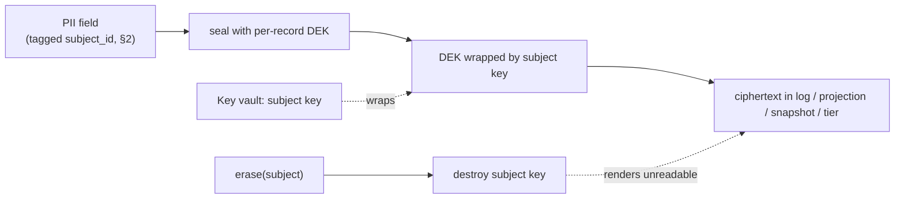
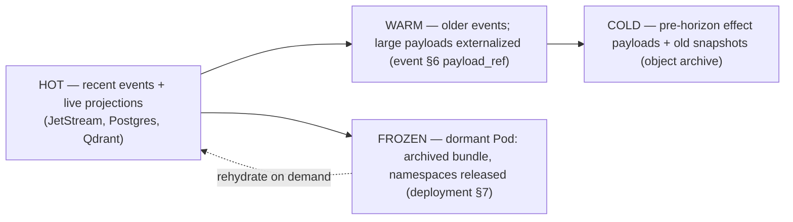

# State-Plane Governance

**Status:** Draft · **Spec version:** `podmu.dev/v1` · **Layer:** Cross-cutting data lifecycle

> Added in response to architecture review (`Feedback.md` §3, §4, §8.3). Unifies
> four deferrals: PII erasure (memory §14, tool §14, frontend §13), snapshot
> cadence (memory §8.5/§14, runtime §17, event §15), cold-state tiering
> (event §12), and the thick/thin portability boundary (pod-spec §9.3,
> Feedback §2). Builds on [`event-system.md`](event-system.md),
> [`memory-system.md`](memory-system.md), [`governance-hitl.md`](governance-hitl.md).

---

## 1. The Core Tensions

The State plane is governed by three forces that pull against the architecture's
foundations:

1. **Erasure vs. immutability.** The event log is append-only and is the source
   of truth (event §1); everything is a projection of it (memory §4). Yet privacy
   law (GDPR-style right-to-erasure) *requires* a customer's personal data to be
   deletable. You cannot delete from an immutable log without breaking replay and
   the causation chain.
2. **Growth vs. cost.** The log grows forever and effect payloads (LLM outputs)
   can be large (event §6). Unbounded hot storage is infeasible.
3. **Portability vs. scale.** Thick bundles (embedded state) promise portability
   (pod-spec §9.3), but a mature Pod's TBs of history cannot physically move
   (Feedback §2) — the promise breaks if taken literally.

This spec resolves all three with one mechanism each, and shows they cohere.

---

## 2. PII Classification & Subject Tagging  *(the foundational requirement)*

Erasure is impossible unless the system *knows, for every datum, whose personal
data it is*. So before anything else: **all PII is classified and tagged with a
data-subject at the edge, at write time.**

- A **subject** is a data subject — typically a customer/lead — identified by a
  stable `subject_id` within the Pod.
- **Ingress is the classification point** (tool §6): as external facts become
  events, PII-bearing fields are tagged with their `subject_id` and a **class**
  (§5.3). Agent/tool outputs that introduce PII are tagged likewise.
- Tagging is **mandatory and validated** — an event/record carrying untagged
  free-text that may contain PII is treated as PII by default (fail safe).

Tagging is what makes both crypto-shredding (§4) and marketplace sanitization
(§8) mechanical rather than best-effort.

---

## 3. Crypto-Shredding (erasure without mutation)

You cannot rewrite the log, so you make the data **permanently unreadable** while
leaving the log structurally intact:

- **Per-subject keys.** Each subject has an encryption key in a **key vault**
  (separate from the data stores). PII fields are encrypted via envelope
  encryption: each record's PII is sealed with a per-record DEK, the DEK wrapped
  by the subject key.
- **What is encrypted:** the *PII payload fields* — across log event payloads,
  business-state rows, memory entries, and vector payloads.
- **What stays cleartext:** the event **envelope** (event §4) — `event_id`,
  `sequence`, `type`, `causation_id`, `correlation_id`, timestamps,
  `subject_id`. These are non-PII (or pseudonymous) and must remain readable so
  the log's *structure, ordering, and causality* survive erasure.
- **Erasure = destroy the subject key.** Deleting the subject key (and its
  wrapped DEKs) renders every ciphertext for that subject permanently
  undecryptable — across log, snapshots, projections, and *every storage tier*
  (§7) at once, without touching a single stored byte of the immutable log.



---

## 4. Erasure and the Replay Floor  *(the hard constraint)*

Crypto-shredding interacts with deterministic replay in a way that **must** be
made explicit, or recovery silently breaks.

**The problem.** Replay re-applies events and re-feeds recorded effects
(runtime §8, memory §4). If a shredded PII payload is encountered during replay,
it is unreadable — a workflow/agent step that consumed that content cannot be
reproduced. So shredding can break genesis replay.

**The resolution — erasure is only permitted *behind a verified snapshot
horizon* (memory §8):**

- Recovery never replays before the latest verified snapshot (the replay base,
  memory §9). Events before the horizon are retained for *structure/audit* but
  are **never re-applied**. Therefore their PII payloads may be shredded with no
  effect on recovery.
- The snapshot's *materialized projections* also contain PII — so erasure shreds
  the subject's PII **in the snapshot and live projections too**, not just the
  pre-horizon log.
- **Erasure latency = snapshot cadence.** A subject whose PII sits in
  *un-snapshotted recent* events cannot be erased until a snapshot supersedes
  them. An erasure request therefore *forces or awaits* the next horizon, then
  shreds. (Privacy law's "without undue delay" tolerates this; cadence §6 bounds
  it.)

> **Consequence (state it plainly):** once a subject is erased, the snapshot
> horizon at erasure time becomes a **hard replay floor** for that data —
> genesis replay through shredded PII is permanently impossible. The verified
> snapshot, not genesis, is the only supported replay base after any erasure.
> This refines event §12: domain-event *envelopes* are permanent; their *PII
> payloads* are erasable.

### 4.1 Pseudonymization for legally-retained records

Not all subject data is erasable. Financial/tax records of transactions must be
*retained* by law even after an erasure request. So PII classes (§2, §5.3)
distinguish:

- **Erasable identifiers / content** — contact details, conversation text,
  behavioral data → crypto-shredded on erasure.
- **Retained records** — invoice amounts, tax-relevant transaction facts →
  **pseudonymized** (the link to the identity is shredded, the anonymized
  aggregate is retained). Erasure removes *who*, not the lawful *what*.

---

## 5. Snapshot Cadence & Incremental Snapshots  *(resolving the long deferral)*

The snapshot mechanism (memory §8) defined *what* a snapshot is; this fixes
*when* and *how often* — the decision deferred since pod-spec §12.

### 5.1 Cadence

A snapshot is taken on the **earliest** of:

- an **event-count** threshold (bounds replay length → recovery time);
- an **elapsed-time** threshold (bounds erasure latency, §4);
- **on demand** — before export/fork (§8), or to flush a pending erasure (§4).

The horizon advances only when a snapshot is **verified** (memory §8.4). The
horizon drives replay base (memory §9), tiering eligibility (§7), and
erasure eligibility (§4) — one cursor, three consumers.

### 5.2 Full vs. incremental

- **Full snapshot** materializes all projections at sequence S.
- **Incremental snapshot** captures only the delta since the last horizon (CDC
  over the projections). Recovery = load base + apply delta chain + replay the
  short tail.
- **Compaction:** a chain of deltas is periodically folded into a new full base,
  trading recovery time (chain length) against snapshot cost. The memory §8
  mechanism admits deltas without redesign.

### 5.3 PII class tags (used by §3, §4.1, §8)

| Class | Examples | On erasure | On marketplace export |
|---|---|---|---|
| `identifier` | name, phone, email | shred | strip |
| `content` | message text, uploads | shred | strip |
| `behavioral` | clicks, page views | shred (or aggregate) | aggregate only |
| `retained` | invoice/tax amounts | pseudonymize (§4.1) | aggregate only |
| `non_pii` | product catalog, branding | — | included |

---

## 6. Cold-State Tiering

Distinct from erasure: moving *cold* data to cheaper storage without losing it.



Tiering rules — it must **never** violate two boundaries:

1. **Retention horizon (memory §9, event §12):** nothing a valid snapshot replay
   base still needs may be moved out of reach. Effect payloads tier only *behind*
   the verified horizon. Domain-event envelopes stay queryable for audit.
2. **Erasure (§3):** tiered data is **still encrypted under subject keys**, so
   crypto-shredding works regardless of tier — destroying a key erases hot,
   warm, cold, and frozen copies simultaneously. Tiering never escapes erasure.

A **frozen** Pod (dormant business) is archived to a thick bundle (§8,
deployment §7), its live namespaces released; it rehydrates on demand by
materializing the bundle (runtime §5).

---

## 7. The Portability Boundary  *(honest scoping)*

The review is right: literal "move the whole business including TBs of history"
does not scale. So portability is **tiered by what is actually moved**, and the
marketing promise is scoped to match:

| Export mode | Contains | Scales? | Use |
|---|---|---|---|
| **Definition-only** | the Definition plane (pod-spec §2.1) — the business "source code" | always | versioning, diff, backup of logic |
| **Seed / template (clone)** | Definition + **reset** State (pod-spec §2.3) | always | marketplace funnel/template reuse; **no PII, no history** |
| **Full thick (fork-with-state)** | Definition + latest snapshot + log | bounded | young/small Pods, or **async archival** for large ones |
| **Marketplace intelligence** | Definition + **sanitized consolidated memory** (§8.1) | always | selling "business intelligence" (Goals.md) |

- **"Portable business" means Definition + bounded/seed state — not teleporting a
  five-year-old company's full event log.** Full thick export of a mature Pod is
  a heavy, async, cold-storage-backed *archival* operation, not an interactive
  one. State this plainly rather than implying otherwise.
- Clones reset State (pod-spec §2.3), so the common marketplace path
  ("clone a funnel") is inherently cheap and PII-free.

### 7.1 Marketplace export sanitization

Selling "business intelligence" must not leak customer PII. Crypto-shredding's
tagging (§2) + consolidation (memory §7) make this mechanical:

- Export the **consolidated, de-identified** memory — `summarized` rollups and
  `non_pii`/aggregated facts — never raw per-subject records.
- The PII class tags (§5.3) drive an automatic sanitization pass: `identifier`
  and `content` stripped, `behavioral`/`retained` aggregated. An export failing
  to classify a field treats it as PII and strips it (fail safe, §2).

---

## 8. Governance & Audit Integration

Erasure and tiering are **governed, audited operations**, not silent background
jobs — unifying the overlap flagged in governance-hitl §10:

- An erasure is triggered by a subject request or a retention policy, runs as a
  governed action (governance §6 authority), and emits `subject.erased`
  (carrying `subject_id` and horizon, **never** PII) — a lifecycle/system event
  (event §2), permanent and auditable.
- `subject.erased` and `memory.corrected` (governance §5) are unified here:
  both are *journaled facts that data was made unavailable*; correction targets a
  specific wrong datum, erasure targets a subject. Neither rewrites the log.
- Tiering and snapshot/horizon advances emit `state.tiered` / `snapshot.verified`
  so the data lifecycle is fully auditable — "where is this data and is it still
  readable?" is answerable from the log (event §10 causality).

---

## 9. Interfaces (contracts, not implementations)

```go
// Crypto-shredding (§3, §4). Keys live in a vault separate from data stores.
type SubjectKeys interface {
    Seal(subjectID string, class PIIClass, plain []byte) (cipher []byte, err error) // §2,§3
    Open(subjectID string, cipher []byte) (plain []byte, err error)                  // fails after erase
    Erase(ctx, subjectID string) (Event, error)  // destroy key → emits subject.erased (§8)
}

// Snapshot cadence & horizon (§5). One horizon, three consumers (§5.1).
type HorizonManager interface {
    ShouldSnapshot(stats PodStats) (bool, Mode)   // Full | Incremental (§5.2)
    Advance(ctx, snap SnapshotManifest) error      // verify → move horizon
    Horizon(ctx, podID ULID) (sequence uint64, err error)
}

// Tiering (§6). Never crosses the horizon or escapes erasure.
type Tiering interface {
    Tier(ctx, podID ULID, belowHorizon uint64) error  // hot→warm→cold
    Freeze(ctx, podID ULID) (BundleRef, error)         // dormant → archived bundle
    Rehydrate(ctx, BundleRef) error
}

// Export modes (§7). Sanitization driven by PII class tags (§5.3, §7.1).
type Exporter interface {
    DefinitionOnly(ctx, podID ULID) (Bundle, error)
    SeedClone(ctx, podID ULID) (Bundle, error)          // Definition + reset State
    ThickArchive(ctx, podID ULID) (Bundle, error)        // async for large Pods
    MarketplaceIntelligence(ctx, podID ULID) (Bundle, error) // sanitized
}
```

---

## 10. Invariants Summary

1. **All PII is classified and subject-tagged at the edge** — untagged free-text
   is PII by default. §2
2. **Erasure is crypto-shredding** — destroy the subject key; the immutable log
   is never mutated. §3
3. **Erasure is only permitted behind a verified snapshot horizon**; that horizon
   becomes a hard replay floor for the erased data. §4
4. **Envelopes stay cleartext, PII payloads are erasable** — structure/causality
   survive erasure. §3, §4
5. **Legally-retained records are pseudonymized, not shredded.** §4.1
6. **One horizon drives replay base, tiering, and erasure eligibility.** §5.1
7. **Tiering never crosses the horizon and never escapes erasure** (tiered data
   stays encrypted). §6
8. **Portability = Definition + bounded/seed state**, not full-history teleport;
   marketplace export is sanitized by class tags. §7
9. **Erasure and tiering are journaled, governed, and auditable** — never silent.
   §8

---

## 11. Deferred / Open Questions

- **Key vault topology & HA** — where subject keys live, their own backup/erasure
  guarantees (a key backup that outlives "erasure" defeats it), and rotation. §3
- **Crypto-shredding granularity vs. cost** — per-subject vs. per-record-per-
  subject keys; envelope-encryption overhead on the append hot path. §3
- **Erasure of shared/derived data** — a summary (memory §7) computed from many
  subjects' data: how to erase one subject's contribution without recomputing.
  Likely: consolidation must itself be PII-tagged or kept subject-free. §7.1
- **Cross-pod / marketplace subject identity** — a subject appearing in multiple
  Pods (federation, event §15); erasure scope across Pods. Deferred with inter-Pod
  comms.
- **Retention policy DSL** — declaring per-class retention windows
  (auto-erase after N days) as Definition-plane policy (governance §3 shape).
- **Legal hold** — suspending erasure/tiering for litigation; conflicts with
  auto-erasure and must override it. §4.1, §8.

---

*Last spec queued from the review:* **Marketplace Tool Trust** — signing,
review, capability manifests, and revocation for third-party MCP servers
(tool §10, §14).
