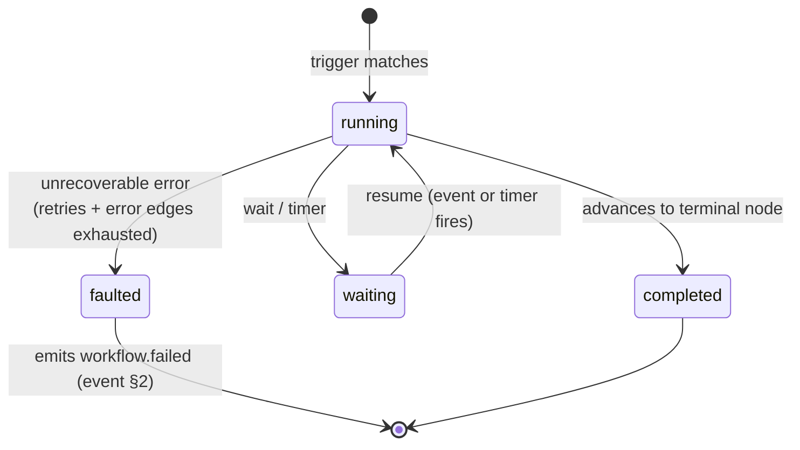

# Workflow Engine

**Status:** Draft · **Spec version:** `podmu.dev/v1` · **Layer:** Core engine

> Builds on [`runtime-arch.md`](runtime-arch.md) (esp. §8 deterministic core /
> journaled effects, §9 single-writer) and [`event-system.md`](event-system.md)
> (esp. §3 events-not-commands, §9 effect keying). The Workflow Engine *is* the
> "deterministic core" those specs refer to. Read them first.

---

## 1. Position & Responsibilities

The Workflow Engine is the only place **control flow** lives (domain-model §4).
Agents *act*; tools *do*; memory *remembers*; **workflows decide what happens
next.** It consumes events, advances workflow instances, issues effect requests,
and emits new events — all deterministically and replayably.

**Owns:** workflow definitions (templates), running instances, triggering,
event-to-instance correlation, control flow, durable timers, retry/error
policy, and the deterministic advancement that makes replay possible.

**Does NOT:** perform I/O, call models, touch external systems, read the clock,
or generate randomness directly. **Every** such operation is an *effect request*
delegated to another engine and journaled (§9). This restriction is not a
guideline — it is what the whole replay guarantee rests on.

---

## 2. The Determinism Contract  *(central, inherited from runtime §8)*

A workflow instance must be a **pure function of `(its event log + recorded
effect results)`**. Replaying the same events and effect results must reach the
exact same position and state, every time.

To make this *structural* rather than a discipline authors must remember, the
Workflow Engine is driven by a **declarative graph** (§4), not imperative code.
A YAML graph simply has no way to call `time.Now()`, open a socket, or invoke an
LLM. The only way to reach nondeterminism is through a declared effect step
(§5), whose result is journaled.

| Forbidden inside a workflow | Allowed instead |
|---|---|
| direct LLM/model call | `agent` step (effect) |
| direct API/HTTP/DB call | `tool` / `memory` step (effect) |
| `time.Now()`, sleep | `wait`/timer step via recorded `clock` (effect) |
| random | `clock`/random effect (recorded) |
| reading shared mutable state | instance variables + memory effects |

---

## 3. Template vs Instance

- A **Workflow** (template) is a Definition-plane artifact: a named, versioned
  graph authored in YAML (`workflows/<name>.yaml`). Addressed by `name` within
  the Pod (domain-model §7).
- A **Workflow Instance** is a running occurrence of a template. It has its own
  `instance_id`, a `correlation_id` (the business "case", event-system §10), a
  pinned `definition_version` (runtime §11), a current **position** (one or more
  active nodes), and a **variable scope** (§7).

Instance state is a **projection** (event-system §7): volatile, lost on crash,
rebuilt by replay (§11). It is never the source of truth — the event log is.

---

## 4. Definition Model

A workflow is a directed graph of **steps** with a **trigger**. Authored
declaratively so it is portable, diff-able, validatable at LOAD (runtime §4),
and — crucially — **safely generatable by AI agents** (§15).

```yaml
# workflows/lead_capture.yaml
workflow: lead_capture
version: 1

trigger:
  on: lead.created                              # event type that STARTS a new instance
  correlation_key: "{{ event.payload.phone_ref }}"  # how later events match this instance (§6)

steps:
  - id: analyze                                 # ── effect: agent ──
    type: agent
    agent: strategist
    input:  { lead: "{{ trigger.payload }}" }
    output: analysis                            # bind result into instance scope

  - id: route                                   # ── pure: decision ──
    type: decision
    branches:
      - when: "{{ analysis.intent == 'hot' }}"
        goto: greet
    default: nurture

  - id: greet                                   # ── effect: agent ──
    type: agent
    agent: closer
    input:  { goal: send_welcome, customer: "{{ trigger.payload }}" }
    output: greeting

  - id: send                                    # ── effect: tool ──
    type: tool
    tool: whatsapp.send_message
    input: { to: "{{ trigger.payload.phone_ref }}", body: "{{ greeting.text }}" }
    idempotency: "{{ instance.id }}:welcome"    # provider-level key (§9)
    retry: { max: 3, backoff: exponential }

  - id: await_reply                             # ── control: wait + durable timer ──
    type: wait
    for: message.received
    match: "{{ instance.correlation_key }}"
    timeout: 24h
    on_timeout: followup

  - id: followup                                # ── composition: subflow ──
    type: subflow
    workflow: wa_followup
    input: { customer: "{{ trigger.payload }}" }

  - id: nurture
    type: end
```

---

## 5. Step Taxonomy

Every step is either **pure** (deterministic, no journaling) or an **effect**
(delegates nondeterminism, journaled per event-system §9).

| Step `type` | Kind | Delegates to | Notes |
|---|---|---|---|
| `agent` | effect | Agent Runtime | invoke an agent; result journaled |
| `tool` | effect | Tool Runtime (MCP) | external action; provider idempotency key |
| `memory.read` | effect | Memory System | journaled (influences decisions, runtime §8) |
| `memory.write` | effect | Memory System | append + durable apply |
| `wait` | control/effect | clock + correlation | wait for event and/or durable timer (§8) |
| `emit` | pure* | Event Log | append a domain event (\*the append is the effect) |
| `decision` | pure | — | branch on instance data |
| `parallel` | pure | — | fork branches, join (§8) |
| `subflow` | pure | Workflow Engine | start/await a child instance |
| `end` | pure | — | terminal node |

---

## 6. Triggering & Correlation  *(the subtle part)*

**Starting an instance.** A workflow declares `trigger.on: <event-type>`. When a
matching event has no existing instance to route to, the engine **starts a new
instance**, seeding `correlation_id` from the trigger event and evaluating
`correlation_key`.

**Routing later events to the right instance.** This is the crux of real
workflows ("the follow-up for *this* lead, after *this* customer replies"):

- Each instance registers its `correlation_key` (e.g. a customer's `phone_ref`)
  in a **correlation index**.
- An incoming event carrying a matching key is routed to that waiting instance's
  `wait` step. Matching is on the declared key, **not** on `correlation_id`
  alone (the inbound `message.received` is a fresh external fact with its own
  ids; the key is what ties it to the case).
- No match + the event is a `trigger.on` type → start a new instance.
- No match + not a trigger → the event is ignored by this workflow (others may
  consume it).

The correlation index is itself a projection rebuilt by replay (§11).

---

## 7. Data Flow & Expressions

- **Variable scope.** Each instance has a scope holding `trigger` (the starting
  event), `instance` (id, correlation_key), and every step's bound `output`.
- **Bindings.** `output: analysis` binds a step's result; later steps read it as
  `{{ analysis.* }}`.
- **Expressions** (`{{ … }}`) are a **pure, sandboxed** language: read-only over
  the instance scope, no I/O, no clock, no randomness, no host access. Any
  nondeterminism must come from an effect step's recorded output, never from an
  expression. This keeps §2 airtight.
- Expression evaluation is deterministic given the scope → safe under replay.

---

## 8. Control Flow

**Decision** — branch on a boolean expression over instance data; deterministic.

**Parallel / join** — fork independent branches; join on `all | any | n`.
Determinism under replay is preserved because branch advancement is driven
**only by log-ordered effect results** (event-system §8): the same log order
reproduces the same interleaving and the same join outcome. Branch step origins
include the branch path so effect keys stay unique (§9).

```yaml
  - id: fanout
    type: parallel
    branches:
      - [generate_post,  publish_ig]
      - [generate_email, send_email]
    join: all
    then: report
```

**Wait + durable timers** — the engine's answer to "do X after 24h unless Y
happens." A `wait` step:

- subscribes the instance to `for: <event-type>` matched by `match:` (§6), and/or
- schedules a **durable timer** via the recorded `clock` capability (runtime
  §12). The timer firing is itself a recorded fact (`timer.fired` effect event),
  so a 24-hour wait survives crashes, restarts, and replays identically.

Whichever fires first (`message.received` vs timeout) deterministically decides
the next node (`on_timeout` vs the normal edge).

**Subflow** — compose workflows; a `subflow` step starts a child instance and
(optionally) awaits its terminal event. Enables reuse (`wa_followup` called from
many parents) — the marketplace "reuse workflows" vision (Goals.md) rests on
this.

---

## 9. Effect Requests & Journaling

When an instance reaches an effect step, the engine (per event-system §3, §9):

1. Computes the **deterministic effect origin**
   `effect_origin = (instance_id, step_id, branch_path, attempt)`.
2. **Replay:** if the journal has a recorded result for that origin → return it,
   **no re-execution** (runtime §8).
3. **Live:** issue the in-process effect request to the target engine, then
   append the result as an **effect event** (`agent.responded`, `tool.completed`,
   …) before advancing.
4. `attempt` increments on retry, yielding a distinct origin per try, so retried
   effects are individually journaled and never confused on replay.

External-acting tools additionally pass a **provider idempotency key**
(`idempotency:` in the step) so even a *live* retry cannot double-act on the
outside world (event-system §9).

---

## 10. Instance Lifecycle



`waiting` is the steady state for long-running business processes (a follow-up
that waits a day, a funnel that spans weeks). Waiting instances cost nothing but
their correlation-index entry and a durable timer; the Runtime can drain/restart
freely (runtime §10) without losing them.

---

## 11. Replay & Resumption

The engine reconstructs all instance state from the log (runtime §10, §5):

1. Read the event log from the replay base (event-system §7).
2. For each event:
   - **trigger-type domain event with no live instance** → start an instance.
   - **correlated domain event** → route to the waiting instance; advance.
   - **effect event** → feed the recorded result to the awaiting step; advance
     **without re-executing** the effect (§9).
   - **`timer.fired`** → resume the corresponding `wait`.
3. Rebuild the correlation index and per-instance variable scopes as a
   side effect of the above.
4. At the head, resume live processing; in-flight effects with no recorded
   result are (re)issued.

Because workflows are pure (§2) and effects are journaled (§9), the rebuilt state
is bit-identical to the pre-crash state. This is the entire payoff of the
deterministic-core design.

---

## 12. Concurrency

- **Across instances:** independent instances advance concurrently; the
  single-writer guarantee (runtime §9) serializes their *appends* into the one
  per-Pod total order, so there are no write conflicts.
- **Within an instance:** steps are serialized except inside an explicit
  `parallel`. Parallel branches advance only as their effect results arrive in
  log order (§8), so concurrency never introduces nondeterminism.
- An instance is never advanced by two threads at once (per-instance
  serialization), which keeps its variable scope race-free without locks.

---

## 13. Failure Handling

| Mechanism | Scope | Behavior |
|---|---|---|
| **Retry** | per effect step | `retry: { max, backoff }`; each attempt a distinct effect origin (§9) |
| **Error edge** | per step | `on_error: <step>` routes recoverable failures into the graph |
| **Timeout** | `wait` step | `on_timeout: <step>` (§8) |
| **Degraded subsystem** | engine | if a target engine/tool is unhealthy (runtime §14), effects fail/retry; the instance parks in `waiting` rather than faulting |
| **Fault** | instance | retries + error edges exhausted → `faulted`, emits `workflow.failed` |

**Compensation (sagas).** Business workflows touch money and messages, so undo
matters (refund after a failed fulfillment). V1 models compensation *explicitly*
as ordinary error-edge steps that issue compensating tool calls — there is no
implicit rollback. A first-class saga/compensation construct is **deferred**
(§18) until the pattern is exercised in real Pods.

---

## 14. Hot Reload & Versioning

Per runtime §11: a `wait`-ing or running instance is **pinned** to the
`definition_version` it started under (carried on its events,
event-system §11); only **new** instances use a reloaded definition. The engine
keeps the pinned definition available for as long as instances on it survive.
This prevents redefining a graph beneath a long-running instance — essential
when instances can live for weeks.

**The pin is over the *entire Definition projection*, not just the graph.** A
`definition_version` pins the workflow graph **and** the identity, goals,
prompts, and tool bindings that any step (including invoked agents, agent §6)
sees — atomically. Pinning the graph alone would let a long-running instance
drive an agent loaded with *current* identity/goals while executing an *old*
plan ("new goals on an old plan"), producing incoherent behavior. The Definition
is therefore pinned as one immutable snapshot per instance, never per-layer.

---

## 15. Authoring & Validation

Workflows are authored by humans **and generated by agents** (the Podmu premise:
describe intent → system builds the funnel). The declarative graph makes
generation tractable and *validatable* at LOAD (runtime §4):

- every `goto`/`then`/`on_*` target resolves to a real step id;
- referenced `agent`/`tool`/`workflow` names exist in the Definition and are
  permitted by `permissions.tool_scopes` (pod-spec §6);
- declared `trigger.on` and consumed/emitted event types are registered
  (event-system §5);
- expressions reference only in-scope variables;
- the graph is well-formed (reachable terminal, no effect step outside the
  determinism rules of §2).

A generated workflow that fails validation is rejected before it can run —
agents cannot author a workflow that breaks determinism or escapes permissions.

---

## 16. Interfaces (contracts, not implementations)

```go
// Implements the runtime Engine interface (runtime §15).
type WorkflowEngine interface {
    Engine // Init / Start / Handle(Event) []Event / Drain

    // Handle routes an event: start | correlate+advance | ignore (§6, §11).
    // Returns events to append (emitted domain events, effect events).
}

// Instance state — a projection, rebuilt by replay (§11), never authoritative.
type Instance struct {
    ID, CorrelationID  string
    Workflow           string
    DefinitionVersion  int        // pinned (§14)
    Position           []NodeID   // active nodes (>1 inside parallel)
    Scope              VarScope    // §7
    Status             InstanceStatus // running | waiting | completed | faulted
}

// Resolves which waiting instance an event belongs to (§6).
type CorrelationIndex interface {
    Register(instanceID, key string)
    Match(event Event) (instanceID string, ok bool)
}

// Durable timers backed by the recorded clock (§8, runtime §12).
type TimerService interface {
    Schedule(instanceID, stepID string, fireAt RecordedTime) TimerID
    // firing appends a `timer.fired` effect event
}
```

---

## 17. Invariants Summary

1. **Workflows are pure** over (events + recorded effects); nondeterminism only
   via effect steps. §2, §9
2. **Declarative graph**, not code — determinism is structural, not disciplinary.
   §4
3. **Control flow lives only here**; agents/tools/memory never branch. §1
4. **Instance state is a projection**, rebuilt by replay, never authoritative.
   §3, §11
5. **Effect origin** `(instance, step, branch, attempt)` keys journaling and
   replay. §9
6. **Correlation by declared key**, not by `correlation_id` alone. §6
7. **Durable timers are recorded facts** — long waits survive crashes/replay. §8
8. **Running instances pin their definition version.** §14
9. **Generated workflows are validated** before they can run. §15

---

## 18. Deferred / Open Questions

- **First-class compensation / saga** construct (§13) — deferred until the
  explicit-error-edge approach proves insufficient.
- **Expression language definition** — exact grammar, type system, and sandbox
  of `{{ … }}` (§7). Must be provably side-effect-free; candidate: a restricted
  CEL-like evaluator.
- **Dynamic / agent-planned workflows** — V1 graphs are static (authored, then
  run). A future mode where an agent *plans the next step at runtime* conflicts
  with static determinism; would need the plan itself journaled as an effect.
  Deferred — strategically important to the "autonomous" vision, so flagged.
- **Parallel fan-out cardinality** — dynamic fan-out (one branch per item in a
  list whose size is only known at runtime) needs careful effect-origin keying.
  Deferred.
- **Correlation index scale & GC** — when waiting instances are abandoned (lead
  never replies, no timeout set), index entries leak. Needs a reaper policy.
- **Sub-flow failure propagation** — how a faulted child surfaces to its parent
  (`subflow`, §8); define with compensation.

---

*Next spec in order:* **Agent Runtime** — how `agent` effect steps are executed:
the agent tool-use loop, model invocation, memory access, and how a
non-deterministic agent invocation is wrapped as a single journaled effect.
